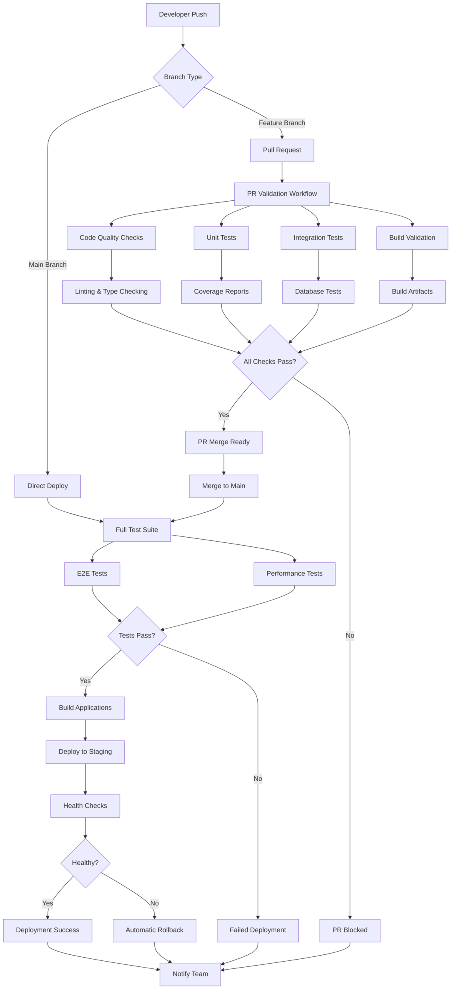
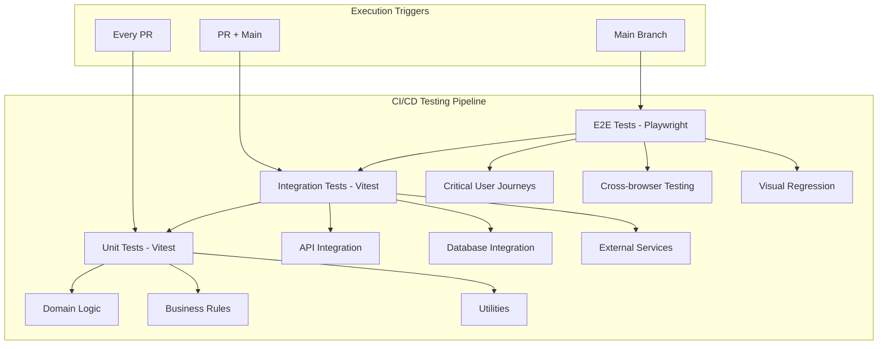
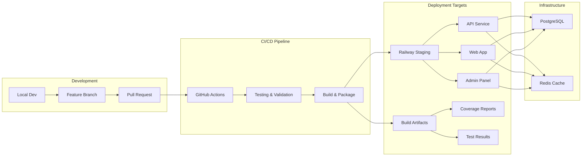
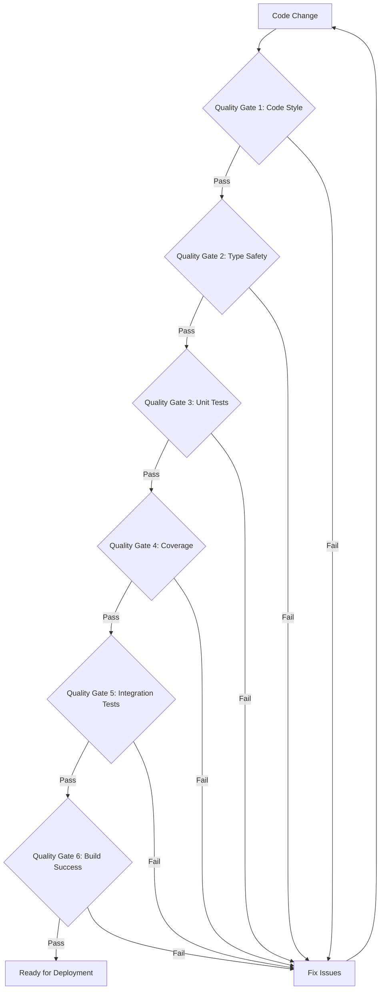
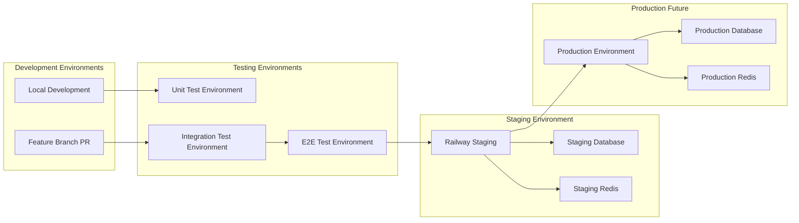
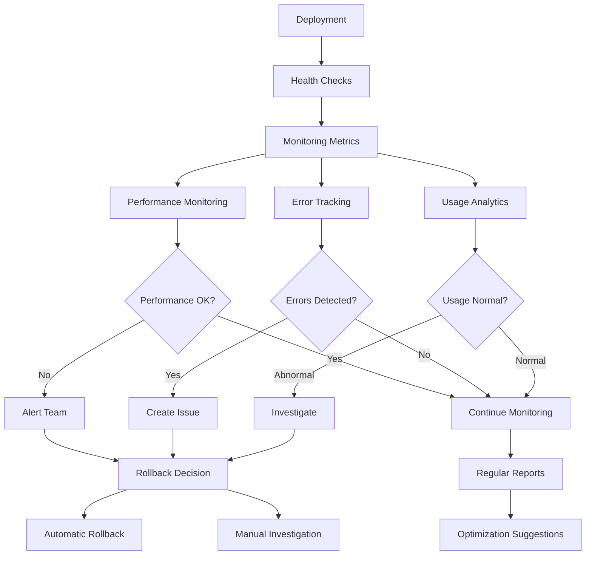
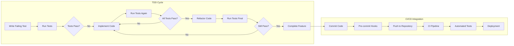
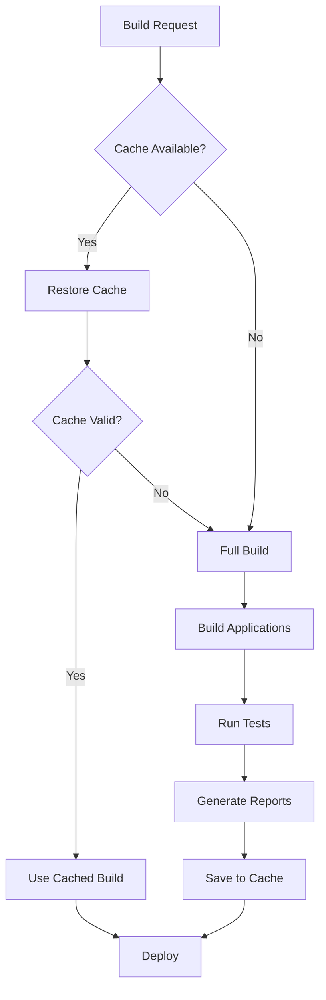
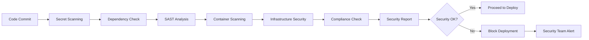

# CI/CD Pipeline Architecture Diagram

## Overview

This document contains visual diagrams representing the CI/CD pipeline architecture for the PEMS project.

## Pipeline Flow Diagram

## Testing Strategy Pyramid

## Deployment Architecture

## Quality Gates Flow

## Environment Management

## Monitoring and Feedback Loop

## TDD Workflow Integration

## Cache Strategy

## Security and Compliance

## Key Components Summary

### 1. Triggers
- Pull requests to main/develop branches
- Pushes to main branch
- Scheduled maintenance runs

### 2. Quality Gates
- Code style and linting
- Type checking
- Unit test coverage (>80%)
- Integration test success
- Build validation
- Security scanning

### 3. Testing Levels
- Unit tests: Every PR
- Integration tests: Every PR
- E2E tests: Main branch merges

### 4. Deployment Strategy
- Staging deployment on main merge
- Health checks and rollback
- Artifact storage and caching

### 5. Monitoring
- Real-time health monitoring
- Performance tracking
- Error alerting
- Usage analytics

This architecture ensures reliable, automated, and secure deployment processes while maintaining high code quality and test coverage standards.