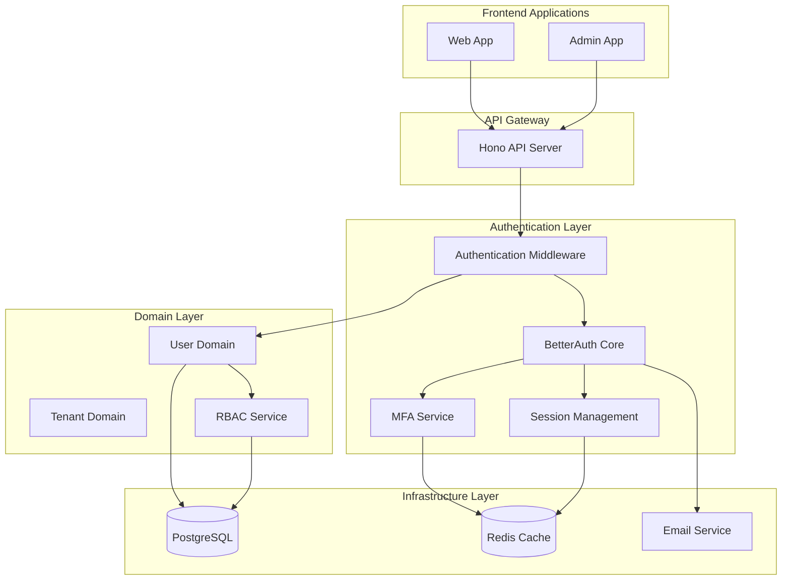

# PO-4: User Authentication System Implementation Plan

## Overview

This document provides a comprehensive implementation plan for PO-4: User Authentication System, following the architecture decisions and technical requirements outlined in the project's ADRs.

## Current State Summary

### ✅ Already Implemented

- BetterAuth 1.4.3 configured in infrastructure
- RBAC system with roles and permissions
- PostgreSQL schema with user tables
- Tenant context middleware for multi-tenant support
- Basic UI auth components (login/register forms)
- Shared validation schemas
- Tenant management module as DDD reference

### ❌ Missing Components

- User management domain module (empty)
- BetterAuth integration with user domain
- TOTP-based MFA implementation
- Password reset and magic link functionality
- Authentication API routes
- Session management integration
- Tenant-aware authentication
- Comprehensive UI components

## Architecture Overview



## Implementation Phases

### Phase 1: Domain Foundation

#### 1.1 User Domain Entities

**Location**: `modules/user-management/src/domain/`

**Files to Create**:

- `user.ts` - Core user entity
- `user-profile.ts` - User profile entity
- `user-auth-provider.ts` - Authentication provider entity
- `user-role.ts` - User role assignment entity
- `value-objects/` - Email, Password, PhoneNumber value objects
- `domain-events.ts` - User-related domain events
- `exceptions.ts` - Domain-specific exceptions

**Key Features**:

- Follow DDD patterns like tenant management
- Implement proper validation and business rules
- Support tenant-aware user operations
- Include domain events for cross-cutting concerns

#### 1.2 Repository Interfaces

**Location**: `modules/user-management/src/infrastructure/`

**Files to Create**:

- `user-repository.ts` - Repository interface
- `user-profile-repository.ts` - Profile repository interface
- `user-auth-provider-repository.ts` - Auth provider repository interface

### Phase 2: Infrastructure Implementation

#### 2.1 PostgreSQL Repository Implementation

**Location**: `modules/user-management/src/infrastructure/`

**Files to Create**:

- `prisma-user-repository.ts` - Prisma-based user repository
- `prisma-user-profile-repository.ts` - Profile repository implementation
- `prisma-user-auth-provider-repository.ts` - Auth provider repository

**Key Features**:

- Implement tenant-aware queries
- Use existing Prisma client configuration
- Support transactional operations
- Include proper error handling

#### 2.2 BetterAuth Integration

**Location**: `packages/infrastructure/auth/src/`

**Files to Modify/Create**:

- `index.ts` - Enhance existing BetterAuth config
- `tenant-aware-adapter.ts` - Custom adapter for multi-tenant support
- `auth-service.ts` - Service layer for BetterAuth operations
- `mfa-service.ts` - TOTP-based MFA implementation
- `password-service.ts` - Password reset and magic links

**Key Features**:

- Tenant-aware authentication
- TOTP MFA with backup codes
- Password reset via email
- Magic link authentication
- Secure session management

### Phase 3: Application Services

#### 3.1 User Application Services

**Location**: `modules/user-management/src/application/`

**Files to Create**:

- `user-service.ts` - Core user management operations
- `auth-service.ts` - Authentication business logic
- `mfa-service.ts` - MFA setup and verification
- `password-service.ts` - Password management operations

**Key Features**:

- User registration and login
- Profile management
- MFA setup and verification
- Password reset and change
- Role assignment and management

### Phase 4: API Integration

#### 4.1 Authentication Routes

**Location**: `apps/api/src/routes/auth/`

**Files to Create**:

- `auth-routes.ts` - Main authentication endpoints
- `user-routes.ts` - User management endpoints
- `mfa-routes.ts` - MFA-specific endpoints
- `password-routes.ts` - Password management endpoints

**Endpoints to Implement**:

```
POST   /api/auth/register
POST   /api/auth/login
POST   /api/auth/logout
POST   /api/auth/refresh
POST   /api/auth/forgot-password
POST   /api/auth/reset-password
POST   /api/auth/magic-link
GET    /api/auth/magic-link/:token
POST   /api/auth/mfa/setup
POST   /api/auth/mfa/verify
POST   /api/auth/mfa/disable
GET    /api/users/profile
PUT    /api/users/profile
POST   /api/users/change-password
```

#### 4.2 Middleware Updates

**Location**: `apps/api/src/middleware/`

**Files to Modify/Create**:

- `auth-middleware.ts` - Authentication middleware
- `permission-middleware.ts` - RBAC permission checking
- `tenant-auth-middleware.ts` - Tenant-aware auth

### Phase 5: UI Components

#### 5.1 Enhanced Authentication Components

**Location**: `packages/ui/src/components/auth/`

**Files to Create/Enhance**:

- `login-form.tsx` - Enhanced with MFA support
- `register-form.tsx` - Enhanced registration
- `mfa-setup-form.tsx` - TOTP setup component
- `mfa-verify-form.tsx` - MFA verification
- `forgot-password-form.tsx` - Password reset request
- `reset-password-form.tsx` - Password reset confirmation
- `magic-link-form.tsx` - Magic link request
- `change-password-form.tsx` - Password change
- `profile-form.tsx` - User profile management

#### 5.2 User Management Components

**Location**: `packages/ui/src/components/user/`

**Files to Create**:

- `user-list.tsx` - User management for admins
- `user-detail.tsx` - User detail view
- `user-create-form.tsx` - Create new user
- `user-edit-form.tsx` - Edit existing user
- `role-assignment.tsx` - Role management

### Phase 6: Testing & Documentation

#### 6.1 Test Suite

**Locations**: Various test directories

**Test Types**:

- Unit tests for domain logic
- Integration tests for repositories
- API endpoint tests
- E2E tests for authentication flows
- Component tests for UI elements

#### 6.2 Documentation

**Files to Create**:

- `API_DOCUMENTATION.md` - Complete API reference
- `USER_MANAGEMENT_GUIDE.md` - User management guide
- `MFA_SETUP_GUIDE.md` - MFA configuration guide
- `TROUBLESHOOTING.md` - Common issues and solutions

## Security Implementation Details

### Password Security

- Use BetterAuth's built-in Argon2 hashing
- Implement password strength validation
- Support password history tracking
- Enforce password expiration policies

### MFA Security

- TOTP implementation using `otplib` library
- Secure storage of TOTP secrets
- Backup code generation and validation
- Rate limiting for MFA attempts

### Session Security

- Secure HTTP-only cookies
- CSRF protection
- Session expiration and refresh
- Concurrent session management

### Tenant Isolation

- Row-level security enforcement
- Tenant-aware authentication
- Cross-tenant admin access control
- Audit logging for tenant operations

## Database Schema Updates

### New Tables/Fields Needed

```sql
-- Enhanced user authentication providers
ALTER TABLE user_auth_providers ADD COLUMN mfa_secret VARCHAR(255);
ALTER TABLE user_auth_providers ADD COLUMN backup_codes JSON;
ALTER TABLE user_auth_providers ADD COLUMN mfa_enabled BOOLEAN DEFAULT FALSE;

-- Password reset tokens
CREATE TABLE password_reset_tokens (
    id UUID PRIMARY KEY DEFAULT uuidv7(),
    user_id UUID NOT NULL REFERENCES users(id),
    token VARCHAR(255) NOT NULL UNIQUE,
    expires_at TIMESTAMP NOT NULL,
    created_at TIMESTAMP DEFAULT NOW()
);

-- Magic link tokens
CREATE TABLE magic_link_tokens (
    id UUID PRIMARY KEY DEFAULT uuidv7(),
    user_id UUID NOT NULL REFERENCES users(id),
    token VARCHAR(255) NOT NULL UNIQUE,
    expires_at TIMESTAMP NOT NULL,
    created_at TIMESTAMP DEFAULT NOW()
);

-- User sessions (for BetterAuth integration)
CREATE TABLE user_sessions (
    id UUID PRIMARY KEY DEFAULT uuidv7(),
    user_id UUID NOT NULL REFERENCES users(id),
    token VARCHAR(255) NOT NULL UNIQUE,
    expires_at TIMESTAMP NOT NULL,
    created_at TIMESTAMP DEFAULT NOW(),
    last_used_at TIMESTAMP DEFAULT NOW()
);
```

## Environment Variables Required

```env
# BetterAuth Configuration
BETTERAUTH_SECRET=your-secret-key
BETTERAUTH_URL=http://localhost:3002

# Email Configuration
SMTP_HOST=smtp.gmail.com
SMTP_PORT=587
SMTP_USER=your-email@gmail.com
SMTP_PASS=your-app-password

# TOTP Configuration
TOTP_ISSUER=PEMS
TOTP_DIGITS=6
TOTP_PERIOD=30

# Session Configuration
SESSION_SECRET=your-session-secret
SESSION_EXPIRY=604800 # 7 days

# Frontend URLs
FRONTEND_URL=http://localhost:3000
ADMIN_URL=http://localhost:3001
```

## Performance Considerations

### Database Optimization

- Add indexes for frequently queried fields
- Implement connection pooling
- Use read replicas for user queries
- Optimize tenant isolation queries

### Caching Strategy

- Cache user sessions in Redis
- Cache user permissions
- Cache MFA verification status
- Implement cache invalidation strategies

### Email Queue

- Use message queue for email sending
- Implement retry mechanisms
- Track email delivery status
- Support email templates

## Monitoring and Logging

### Authentication Events

- Login attempts (success/failure)
- MFA setup and verification
- Password reset requests
- Account lockouts
- Role changes

### Metrics to Track

- Authentication success rate
- MFA adoption rate
- Password reset frequency
- Session duration
- API response times

## Deployment Considerations

### Database Migrations

- Create migration scripts for schema updates
- Test migrations on staging environment
- Plan for rollback strategies
- Document migration procedures

### Feature Flags

- Gradual rollout of new features
- A/B testing for authentication flows
- Emergency disable switches
- Environment-specific configurations

## Implementation Timeline

### Week 1: Domain Foundation

- Create user domain entities
- Implement repository interfaces
- Set up basic validation schemas

### Week 2: Infrastructure Layer

- Implement PostgreSQL repositories
- Integrate BetterAuth with tenant awareness
- Set up MFA and password services

### Week 3: Application Services

- Create user and auth services
- Implement business logic
- Add comprehensive error handling

### Week 4: API Integration

- Create authentication routes
- Implement middleware
- Add RBAC integration

### Week 5: UI Components

- Build authentication forms
- Create user management components
- Implement responsive design

### Week 6: Testing & Documentation

- Write comprehensive tests
- Create documentation
- Performance optimization
- Security audit

## Success Criteria

### Functional Requirements

- ✅ Users can register with email and password
- ✅ Login/logout functionality works correctly
- ✅ Password reset functionality is implemented
- ✅ Multi-factor authentication is supported
- ✅ Session management is secure
- ✅ Authentication is tenant-aware

### Non-Functional Requirements

- ✅ Performance: < 200ms response time for auth operations
- ✅ Security: No known vulnerabilities
- ✅ Scalability: Supports 10,000+ concurrent users
- ✅ Reliability: 99.9% uptime
- ✅ Usability: Intuitive authentication flows

## Next Steps

1. **Review and approve this implementation plan**
2. **Set up development environment with required dependencies**
3. **Begin Phase 1 implementation (Domain Foundation)**
4. **Regular progress reviews and adjustments**
5. **Comprehensive testing before deployment**

This implementation plan provides a clear roadmap for delivering a robust, secure, and scalable authentication system that meets all the requirements of PO-4 while following the established architectural patterns in the project.
