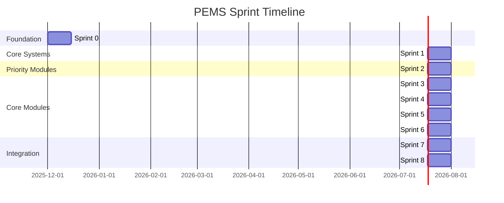
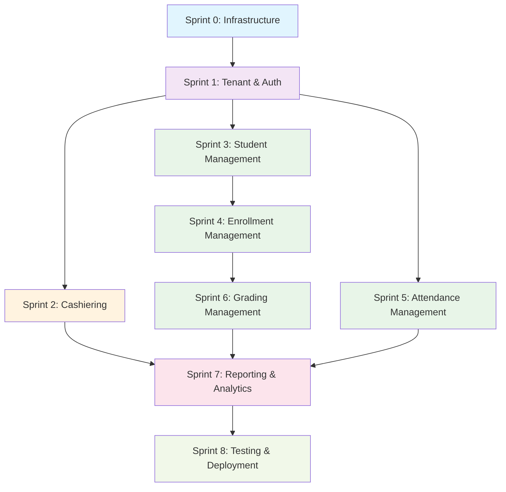
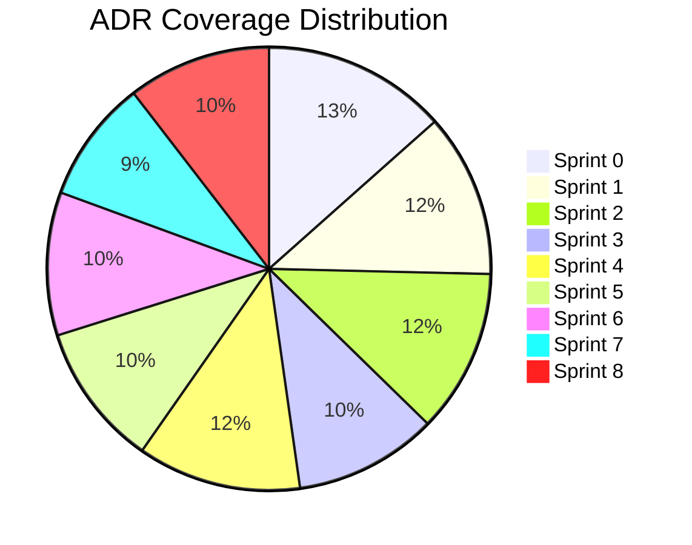

# PEMS Sprint Flow Diagram

## Sprint Dependencies and Flow

## Module Dependencies

## ADR Coverage by Sprint

## Key Architecture Decisions by Sprint

### Sprint 0: Foundation

- ADR-001: Turborepo as Monorepo Build System
- ADR-005: UUIDv7 as Primary Keys
- ADR-006: Prisma ORM with Repository Pattern
- ADR-011: TDD-First Development Workflow
- ADR-015: Vitest for Unit/Integration Testing
- ADR-016: Playwright for E2E Testing
- ADR-017: PostgreSQL as Single Source of Truth
- ADR-020: Zod for Validation
- ADR-021: Tailwind v4 as Styling Framework

### Sprint 1: Core Systems

- ADR-002: Domain-Driven Design (DDD)
- ADR-004: Multi-Tenant Architecture with RLS
- ADR-013: Modular Monolith Architecture
- ADR-014: Domain Events for Module Communication
- ADR-018: BetterAuth for Authentication
- ADR-019: Permission-Based Navigation

### Sprint 2-6: Domain Modules

- ADR-003: CQRS Pattern
- ADR-010: Cashiering Module as First Domain Module
- ADR-012: Shared Packages for Cross-Module Reuse

### Sprint 7-8: Integration & Deployment

- ADR-007: Hono as Backend API Gateway
- ADR-008: oRPC for API Communication
- ADR-009: TanStack Start + SolidJS for Frontend
- ADR-022: Hybrid Deployment Strategy
