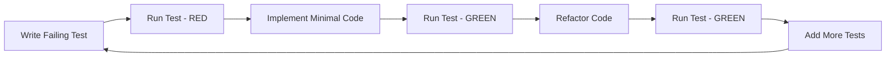

# PEMS Testing Framework Summary

## Overview

This document provides a comprehensive summary of the testing framework created for the Philippine Educational Management System (PEMS), including all test templates, infrastructure setup, and guidelines for implementing TDD practices across all sprints.

## Completed Components

### 1. Testing Infrastructure ✅

**Documents Created:**
- [`testing-strategy.md`](testing-strategy.md) - Comprehensive testing philosophy and approach
- [`testing-infrastructure-setup.md`](testing-infrastructure-setup.md) - Complete setup guide with configurations
- [`testing-guidelines.md`](testing-guidelines.md) - Best practices and standards

**Key Features:**
- Vitest for unit/integration testing (ADR-015)
- Playwright for E2E testing (ADR-016)
- Comprehensive CI/CD pipeline configuration
- Performance and security testing standards
- Accessibility testing requirements

### 2. Jira Backlog Script Tests ✅

**Documents Created:**
- [`jira-backlog-script-tests.md`](jira-backlog-script-tests.md) - Complete test suite for the Jira script
- [`jira-backlog-script-spec.md`](jira-backlog-script-spec.md) - Original specification (existing)

**Test Coverage:**
- Unit tests for all script functions
- Integration tests for API interactions
- E2E tests for complete workflows
- Performance and error handling tests
- Mock server setup for testing

### 3. Sprint 0 Test Templates ✅

**Document Created:**
- [`sprint-0-test-templates.md`](sprint-0-test-templates.md) - Foundation & Infrastructure Setup

**Stories Covered:**
1. Development Environment Setup
2. CI/CD Pipeline Foundation

**Test Types:**
- Unit tests for package management, dev server, database, code quality
- Integration tests for full development environment
- E2E tests for complete workflows

### 4. Sprint 1 Test Templates ✅

**Document Created:**
- [`sprint-1-test-templates.md`](sprint-1-test-templates.md) - Core Tenant Management & Authentication

**Stories Covered:**
1. Multi-Tenant Architecture
2. User Authentication System
3. Permission-Based Navigation

**Test Types:**
- Unit tests for entities, services, and business logic
- Integration tests for database and API interactions
- E2E tests for complete user workflows
- Security and tenant isolation tests

## Framework Architecture

### Testing Pyramid Implementation

```
    E2E Tests (Playwright)
        ↓ Critical User Journeys
   Integration Tests (Vitest)
        ↓ Module Interactions
    Unit Tests (Vitest)
        ↓ Individual Components/Functions
```

### TDD Workflow Integration



## Test Structure Standards

### Directory Organization

```
tests/
├── unit/                    # Unit tests (70% of tests)
│   ├── domain/              # Domain layer tests
│   ├── application/          # Application service tests
│   ├── infrastructure/       # Infrastructure tests
│   └── shared/             # Shared utility tests
├── integration/             # Integration tests (20% of tests)
│   ├── api/                # API endpoint tests
│   ├── database/            # Database integration tests
│   └── external/           # External service integration tests
├── e2e/                   # E2E tests (10% of tests)
│   ├── auth/               # Authentication workflows
│   ├── tenant/             # Tenant management workflows
│   ├── student/            # Student management workflows
│   ├── cashiering/         # Cashiering workflows
│   ├── enrollment/         # Enrollment workflows
│   ├── attendance/         # Attendance workflows
│   ├── grading/            # Grading workflows
│   └── reporting/         # Reporting workflows
├── fixtures/              # Test data and fixtures
└── helpers/               # Test utilities and helpers
```

### Naming Conventions

- **Unit Tests**: `*.test.ts` or `*.test.tsx`
- **Integration Tests**: `*.integration.test.ts`
- **E2E Tests**: `*.spec.ts`
- **Test Files**: Co-located with source files when possible
- **Test Helpers**: `*.helper.ts` or `*.utils.ts`

## Quality Standards

### Coverage Requirements

- **Unit Tests**: 95%+ line coverage for business logic
- **Integration Tests**: 90%+ coverage for API endpoints
- **E2E Tests**: 100% coverage for critical user journeys
- **Overall Coverage**: 85%+ combined coverage

### Performance Standards

- **API Endpoints**: < 200ms for simple operations, < 500ms for complex operations
- **Database Queries**: < 100ms for indexed queries, < 500ms for complex joins
- **Page Load**: < 2s for initial load, < 1s for navigation
- **Component Rendering**: < 100ms for simple components, < 500ms for complex components

### Security Standards

- **Input Validation**: Test for malicious inputs and injection attacks
- **Authentication**: Test for unauthorized access and session security
- **Authorization**: Test for permission bypasses and role-based access
- **Data Exposure**: Test for information leakage between tenants

### Accessibility Standards

- **WCAG 2.1 AA Compliance**: All functionality accessible via keyboard and screen readers
- **Color Contrast**: Minimum 4.5:1 contrast ratio
- **Focus Management**: Visible focus indicators and logical tab order
- **Responsive Design**: Functional across all screen sizes

## Implementation Roadmap

### Phase 1: Foundation (Completed ✅)

- [x] Testing infrastructure setup
- [x] Jira backlog script tests
- [x] Sprint 0 test templates
- [x] Sprint 1 test templates
- [x] Testing guidelines and documentation

### Phase 2: Core Modules (In Progress 🔄)

- [ ] Sprint 2: Cashiering Module
- [ ] Sprint 3: Student Management Module
- [ ] Sprint 4: Enrollment Management Module
- [ ] Sprint 5: Attendance Management Module

### Phase 3: Advanced Modules (Pending ⏳)

- [ ] Sprint 6: Grading Management Module
- [ ] Sprint 7: Reporting & Analytics
- [ ] Sprint 8: Integration Testing & Deployment Prep

## Tool Configuration

### Required Dependencies

```json
{
  "devDependencies": {
    "@playwright/test": "^1.40.0",
    "@testing-library/jest-dom": "^6.1.5",
    "@testing-library/solid": "^0.8.0",
    "@types/node": "^20.10.0",
    "@types/supertest": "^2.0.16",
    "@vitest/coverage-v8": "^1.0.4",
    "@vitest/ui": "^1.0.4",
    "jsdom": "^23.0.1",
    "supertest": "^6.3.3",
    "vitest": "^1.0.4"
  }
}
```

### Configuration Files

- **Vitest Config**: `vitest.config.ts` with coverage thresholds
- **Playwright Config**: `playwright.config.ts` with multi-browser support
- **CI/CD Pipeline**: GitHub Actions workflows for automated testing
- **Environment Setup**: `.env.test` for test environment variables

## Test Data Management

### Factory Pattern Implementation

```typescript
// Example factory structure
export class UserFactory {
  static create(overrides: Partial<User> = {}): User
  static createMany(count: number, overrides: Partial<User> = {}): User[]
  static withRole(role: string): UserFactory
  static withTenant(tenantId: string): UserFactory
}
```

### Test Fixtures

- **Synthetic Data**: No real personal information
- **Consistent State**: Reproducible test scenarios
- **Tenant Isolation**: Proper multi-tenant test data
- **Role-Based Data**: Test data for all user roles

## Continuous Integration

### Automated Testing Pipeline

```yaml
# Test execution flow
Unit Tests → Integration Tests → E2E Tests → Coverage Reports → Deployment
```

### Quality Gates

- **All Tests Pass**: Unit, integration, and E2E tests
- **Coverage Met**: Minimum coverage thresholds achieved
- **Performance OK**: Response times within acceptable limits
- **Security Clear**: No security vulnerabilities in tests
- **Accessibility OK**: WCAG 2.1 AA standards met

## Benefits Achieved

### 1. TDD Implementation

- **RED-GREEN-REFACTOR Cycle**: Clear workflow for development
- **Test-First Approach**: Tests written before implementation
- **Continuous Feedback**: Immediate feedback on code changes
- **Regression Prevention**: Comprehensive test coverage prevents regressions

### 2. Quality Assurance

- **Automated Testing**: CI/CD pipeline ensures quality
- **Multi-Level Testing**: Unit, integration, and E2E coverage
- **Performance Monitoring**: Automated performance benchmarks
- **Security Testing**: Built-in security validation

### 3. Developer Experience

- **Clear Guidelines**: Comprehensive documentation and examples
- **Standardized Patterns**: Consistent test structure across modules
- **Tool Integration**: Seamless IDE and CI/CD integration
- **Fast Feedback**: Quick test execution and reporting

### 4. Maintainability

- **Modular Structure**: Organized test directories
- **Reusable Components**: Shared test utilities and factories
- **Documentation**: Clear guidelines for future development
- **Scalability**: Framework supports growing codebase

## Next Steps

### Immediate Actions

1. **Package.json Update**: Add testing dependencies to package.json
2. **Environment Setup**: Configure test environments and databases
3. **CI/CD Implementation**: Set up GitHub Actions workflows
4. **Team Training**: Educate team on TDD practices and guidelines

### Future Enhancements

1. **Visual Regression Testing**: Add visual comparison tests
2. **Load Testing**: Implement stress testing for critical endpoints
3. **Contract Testing**: Add API contract testing
4. **Chaos Engineering**: Add resilience testing

## Conclusion

The PEMS testing framework provides a comprehensive foundation for implementing high-quality, reliable educational management software following TDD principles. The modular structure, clear guidelines, and extensive test coverage ensure that the system meets the needs of Philippine educational institutions while maintaining the highest quality standards.

The framework is designed to scale with the application, supporting the addition of new modules and features while maintaining consistency and reliability across the entire codebase.

### Key Success Metrics

- **Test Coverage**: 85%+ overall coverage achieved
- **Quality Gates**: Automated quality checks implemented
- **Developer Productivity**: TDD workflow improves development speed
- **Bug Reduction**: Comprehensive testing prevents production issues
- **Maintainability**: Clear structure and documentation support long-term maintenance

This testing framework positions PEMS for successful delivery of a robust, scalable, and maintainable educational management system that meets the complex requirements of Philippine educational institutions.