# UI Components Demo Plan

## Overview

This document outlines the comprehensive demo strategy for showcasing all new UI components in the PEMS system. The demo will serve as both a testing ground and a reference implementation.

## Demo Structure

```mermaid
graph TB
    subgraph "Demo Application"
        HOME[Home Page]
        MODALS[Modal Demos]
        DROPDOWNS[Dropdown Demos]
        TABLES[Table Demos]
        FORMS[Form Demos]
        NAVIGATION[Navigation Demos]
        PLAYGROUND[Component Playground]
    end
    
    subgraph "Modal Demos"
        MB[Basic Modals]
        MS[Modal Sizes]
        MV[Modal Variants]
        MA[Animated Modals]
        MAD[Modal Accessibility]
        MD[Modal Dialogs]
        MAL[Modal Advanced]
    end
    
    subgraph "Dropdown Demos"
        DB[Basic Dropdowns]
        DM[Dropdown Menus]
        DS[Select Components]
        DC[Combobox Components]
        DN[Nested Dropdowns]
        DA[Dropdown Accessibility]
        DD[Dropdown Advanced]
    end
    
    subgraph "Table Demos"
        TB[Basic Tables]
        TV[Table Variants]
        TS[Sortable Tables]
        TF[Filterable Tables]
        TP[Paginated Tables]
        TE[Expandable Tables]
        TD[Data Tables]
        TA[Table Accessibility]
        TT[Table Advanced]
    end
    
    subgraph "Form Demos"
        FB[Basic Forms]
        FV[Form Validation]
        FC[Complex Forms]
        FM[Multi-step Forms]
        FD[Dynamic Forms]
        FA[Form Accessibility]
        FF[Form Advanced]
    end
    
    subgraph "Navigation Demos"
        NB[Basic Navigation]
        NN[Navbar Components]
        NS[Sidebar Components]
        BC[Breadcrumb Components]
        NT[Tab Components]
        NP[Pagination Components]
        SS[Step Components]
        NA[Navigation Accessibility]
        NV[Navigation Advanced]
    end
    
    HOME --> MODALS
    HOME --> DROPDOWNS
    HOME --> TABLES
    HOME --> FORMS
    HOME --> NAVIGATION
    HOME --> PLAYGROUND
    
    MODALS --> MB
    MODALS --> MS
    MODALS --> MV
    MODALS --> MA
    MODALS --> MAD
    MODALS --> MD
    MODALS --> MAL
    
    DROPDOWNS --> DB
    DROPDOWNS --> DM
    DROPDOWNS --> DS
    DROPDOWNS --> DC
    DROPDOWNS --> DN
    DROPDOWNS --> DA
    DROPDOWNS --> DD
    
    TABLES --> TB
    TABLES --> TV
    TABLES --> TS
    TABLES --> TF
    TABLES --> TP
    TABLES --> TE
    TABLES --> TD
    TABLES --> TA
    TABLES --> TT
    
    FORMS --> FB
    FORMS --> FV
    FORMS --> FC
    FORMS --> FM
    FORMS --> FD
    FORMS --> FA
    FORMS --> FF
    
    NAVIGATION --> NB
    NAVIGATION --> NN
    NAVIGATION --> NS
    NAVIGATION --> BC
    NAVIGATION --> NT
    NAVIGATION --> NP
    NAVIGATION --> SS
    NAVIGATION --> NA
    NAVIGATION --> NV
```



## Demo Pages Structure

### 1. Enhanced UI Components Demo Page

#### File: `apps/web/src/routes/enhanced-ui-components-demo.tsx`

```typescript
import type { Component } from 'solid-js'
import { createSignal, For, Show } from 'solid-js'
import { A } from '@tanstack/solid-router'

// Import all new components
import {
  Modal,
  ModalHeader,
  ModalTitle,
  ModalContent,
  ModalFooter,
  AlertDialog,
  ConfirmDialog,
  Dialog,
  DropdownMenu,
  DropdownMenuTrigger,
  DropdownMenuContent,
  DropdownMenuItem,
  Select,
  Combobox,
  Table,
  DataTable,
  Form,
  FormField,
  FormInput,
  FormSelect,
  FormCheckbox,
  Navigation,
  Navbar,
  Sidebar,
  Breadcrumb,
  Tabs,
  Pagination,
  Steps,
} from '@pems/ui'

const EnhancedUIComponentsDemo: Component = () => {
  const [activeCategory, setActiveCategory] = createSignal('modals')
  const [theme, setTheme] = createSignal<'light' | 'dark'>('light')

  const categories = [
    { id: 'modals', label: 'Modals', icon: '🪟', description: 'Dialog and modal components' },
    { id: 'dropdowns', label: 'Dropdowns', icon: '📋', description: 'Menu and select components' },
    { id: 'tables', label: 'Tables', icon: '📊', description: 'Data table components' },
    { id: 'forms', label: 'Forms', icon: '📝', description: 'Form and input components' },
    { id: 'navigation', label: 'Navigation', icon: '🧭', description: 'Navigation components' },
  ]

  const toggleTheme = () => {
    const newTheme = theme() === 'light' ? 'dark' : 'light'
    setTheme(newTheme)
    document.documentElement.classList.toggle('dark', newTheme === 'dark')
  }

  return (
    <div class={`min-h-screen bg-background text-foreground ${theme()}`}>
      {/* Header */}
      <header class="sticky top-0 z-50 w-full border-b bg-background/95 backdrop-blur">
        <div class="container flex h-14 items-center justify-between">
          <div class="flex items-center space-x-4">
            <h1 class="text-xl font-bold">Enhanced UI Components</h1>
            <span class="text-sm text-muted-foreground">
              Comprehensive Component Library
            </span>
          </div>
          <div class="flex items-center space-x-4">
            <A
              href="/ui-components-demo"
              class="text-sm font-medium text-muted-foreground hover:text-foreground"
            >
              Basic Components
            </A>
            <button
              onClick={toggleTheme}
              class="text-sm font-medium text-muted-foreground hover:text-foreground"
            >
              {theme() === 'light' ? '🌙' : '☀️'} Theme
            </button>
          </div>
        </div>
      </header>

      {/* Navigation */}
      <nav class="sticky top-14 z-40 w-full border-b bg-background">
        <div class="container flex h-12 items-center space-x-6 overflow-x-auto">
          <For each={categories}>
            {(category) => (
              <button
                class={`flex items-center space-x-2 text-sm font-medium transition-colors hover:text-primary ${
                  activeCategory() === category.id
                    ? 'text-primary border-b-2 border-primary'
                    : 'text-muted-foreground'
                }`}
                onClick={() => setActiveCategory(category.id)}
              >
                <span>{category.icon}</span>
                <span>{category.label}</span>
              </button>
            )}
          </For>
        </div>
      </nav>

      {/* Main Content */}
      <main class="container py-8">
        {/* Category Description */}
        <div class="mb-8">
          <Show when={categories.find(c => c.id === activeCategory())}>
            {(category) => (
              <div>
                <h2 class="text-3xl font-bold flex items-center gap-2">
                  <span>{category().icon}</span> {category().label}
                </h2>
                <p class="text-muted-foreground mt-2">
                  {category().description}
                </p>
              </div>
            )}
          </Show>
        </div>

        {/* Category Content */}
        <Show when={activeCategory() === 'modals'}>
          <ModalDemos />
        </Show>
        
        <Show when={activeCategory() === 'dropdowns'}>
          <DropdownDemos />
        </Show>
        
        <Show when={activeCategory() === 'tables'}>
          <TableDemos />
        </Show>
        
        <Show when={activeCategory() === 'forms'}>
          <FormDemos />
        </Show>
        
        <Show when={activeCategory() === 'navigation'}>
          <NavigationDemos />
        </Show>
      </main>
    </div>
  )
}

// Individual demo components
const ModalDemos: Component = () => {
  // Modal demo implementations
  return (
    <div class="space-y-16">
      {/* Basic Modal Demo */}
      <section class="space-y-8">
        <h3 class="text-2xl font-semibold">Basic Modal</h3>
        {/* Modal demo content */}
      </section>
      
      {/* Other modal demos */}
    </div>
  )
}

const DropdownDemos: Component = () => {
  // Dropdown demo implementations
  return (
    <div class="space-y-16">
      {/* Dropdown demo content */}
    </div>
  )
}

const TableDemos: Component = () => {
  // Table demo implementations
  return (
    <div class="space-y-16">
      {/* Table demo content */}
    </div>
  )
}

const FormDemos: Component = () => {
  // Form demo implementations
  return (
    <div class="space-y-16">
      {/* Form demo content */}
    </div>
  )
}

const NavigationDemos: Component = () => {
  // Navigation demo implementations
  return (
    <div class="space-y-16">
      {/* Navigation demo content */}
    </div>
  )
}

export default EnhancedUIComponentsDemo
```

### 2. Individual Demo Components

#### Modal Demos

##### Basic Modal Demo
```typescript
const BasicModalDemo: Component = () => {
  const [isOpen, setIsOpen] = createSignal(false)

  return (
    <div class="space-y-4">
      <h4 class="text-lg font-semibold">Basic Modal</h4>
      <p class="text-muted-foreground">
        Simple modal with header, content, and footer
      </p>
      
      <Button onClick={() => setIsOpen(true)}>
        Open Basic Modal
      </Button>
      
      <Modal open={isOpen()} onOpenChange={setIsOpen}>
        <ModalHeader>
          <ModalTitle>Basic Modal</ModalTitle>
        </ModalHeader>
        <ModalContent>
          <p>This is a basic modal with header, content, and footer sections.</p>
        </ModalContent>
        <ModalFooter>
          <Button variant="outline" onClick={() => setIsOpen(false)}>
            Cancel
          </Button>
          <Button onClick={() => setIsOpen(false)}>
            Confirm
          </Button>
        </ModalFooter>
      </Modal>
    </div>
  )
}
```

##### Modal Sizes Demo
```typescript
const ModalSizesDemo: Component = () => {
  const [openModal, setOpenModal] = createSignal<string>('')

  const sizes = [
    { name: 'Small', value: 'sm' },
    { name: 'Medium', value: 'md' },
    { name: 'Large', value: 'lg' },
    { name: 'Extra Large', value: 'xl' },
    { name: 'Full Screen', value: 'full' },
  ]

  return (
    <div class="space-y-4">
      <h4 class="text-lg font-semibold">Modal Sizes</h4>
      <p class="text-muted-foreground">
        Different modal sizes for various use cases
      </p>
      
      <div class="flex flex-wrap gap-2">
        <For each={sizes}>
          {(size) => (
            <Button
              variant="outline"
              onClick={() => setOpenModal(size.value)}
            >
              {size.name}
            </Button>
          )}
        </For>
      </div>
      
      <For each={sizes}>
        {(size) => (
          <Modal
            open={openModal() === size.value}
            onOpenChange={() => setOpenModal('')}
            size={size.value as any}
          >
            <ModalHeader>
              <ModalTitle>{size.name} Modal</ModalTitle>
            </ModalHeader>
            <ModalContent>
              <p>This is a {size.name.toLowerCase()} modal.</p>
              <p class="mt-2">
                Lorem ipsum dolor sit amet, consectetur adipiscing elit. 
                Sed do eiusmod tempor incididunt ut labore et dolore magna aliqua.
              </p>
            </ModalContent>
            <ModalFooter>
              <Button variant="outline" onClick={() => setOpenModal('')}>
                Close
              </Button>
            </ModalFooter>
          </Modal>
        )}
      </For>
    </div>
  )
}
```

#### Dropdown Demos

##### Basic Dropdown Demo
```typescript
const BasicDropdownDemo: Component = () => {
  const handleAction = (action: string) => {
    console.log(`Action: ${action}`)
  }

  return (
    <div class="space-y-4">
      <h4 class="text-lg font-semibold">Basic Dropdown Menu</h4>
      <p class="text-muted-foreground">
        Simple dropdown menu with common actions
      </p>
      
      <DropdownMenu>
        <DropdownMenuTrigger>
          <Button variant="outline">
            Options
            <svg class="ml-2 h-4 w-4" fill="none" stroke="currentColor" viewBox="0 0 24 24">
              <path stroke-linecap="round" stroke-linejoin="round" stroke-width="2" d="M19 9l-7 7-7-7" />
            </svg>
          </Button>
        </DropdownMenuTrigger>
        <DropdownMenuContent>
          <DropdownMenuItem onSelect={() => handleAction('new')}>
            New Document
          </DropdownMenuItem>
          <DropdownMenuItem onSelect={() => handleAction('open')}>
            Open Document
          </DropdownMenuItem>
          <DropdownMenuSeparator />
          <DropdownMenuItem onSelect={() => handleAction('save')}>
            Save
          </DropdownMenuItem>
          <DropdownMenuItem onSelect={() => handleAction('export')}>
            Export
          </DropdownMenuItem>
          <DropdownMenuSeparator />
          <DropdownMenuItem onSelect={() => handleAction('delete')} variant="destructive">
            Delete
          </DropdownMenuItem>
        </DropdownMenuContent>
      </DropdownMenu>
    </div>
  )
}
```

#### Table Demos

##### Basic Table Demo
```typescript
const BasicTableDemo: Component = () => {
  const data = [
    { id: 1, name: 'John Doe', email: 'john@example.com', role: 'Admin' },
    { id: 2, name: 'Jane Smith', email: 'jane@example.com', role: 'User' },
    { id: 3, name: 'Bob Johnson', email: 'bob@example.com', role: 'User' },
    { id: 4, name: 'Alice Brown', email: 'alice@example.com', role: 'Manager' },
  ]

  return (
    <div class="space-y-4">
      <h4 class="text-lg font-semibold">Basic Table</h4>
      <p class="text-muted-foreground">
        Simple table with user data
      </p>
      
      <Table>
        <TableHeader>
          <TableRow>
            <TableHead>Name</TableHead>
            <TableHead>Email</TableHead>
            <TableHead>Role</TableHead>
            <TableHead>Actions</TableHead>
          </TableRow>
        </TableHeader>
        <TableBody>
          <For each={data}>
            {(row) => (
              <TableRow>
                <TableCell>{row.name}</TableCell>
                <TableCell>{row.email}</TableCell>
                <TableCell>{row.role}</TableCell>
                <TableCell>
                  <div class="flex space-x-2">
                    <Button size="sm" variant="outline">Edit</Button>
                    <Button size="sm" variant="ghost">Delete</Button>
                  </div>
                </TableCell>
              </TableRow>
            )}
          </For>
        </TableBody>
      </Table>
    </div>
  )
}
```

#### Form Demos

##### Basic Form Demo
```typescript
const BasicFormDemo: Component = () => {
  const [formData, setFormData] = createSignal({
    name: '',
    email: '',
    role: '',
    newsletter: false,
  })

  const handleSubmit = (data: any) => {
    console.log('Form submitted:', data)
  }

  return (
    <div class="space-y-4">
      <h4 class="text-lg font-semibold">Basic Form</h4>
      <p class="text-muted-foreground">
        Simple form with validation
      </p>
      
      <Form onSubmit={handleSubmit}>
        <div class="space-y-4 max-w-md">
          <FormField name="name" label="Name" required>
            <FormInput
              placeholder="Enter your name"
              value={formData().name}
              onInput={(e) => setFormData(prev => ({ ...prev, name: e.currentTarget.value }))}
            />
          </FormField>
          
          <FormField name="email" label="Email" required>
            <FormInput
              type="email"
              placeholder="Enter your email"
              value={formData().email}
              onInput={(e) => setFormData(prev => ({ ...prev, email: e.currentTarget.value }))}
            />
          </FormField>
          
          <FormField name="role" label="Role">
            <FormSelect
              placeholder="Select a role"
              options={[
                { value: 'user', label: 'User' },
                { value: 'admin', label: 'Admin' },
                { value: 'manager', label: 'Manager' },
              ]}
              value={formData().role}
              onValueChange={(value) => setFormData(prev => ({ ...prev, role: value }))}
            />
          </FormField>
          
          <FormField name="newsletter">
            <FormCheckbox
              label="Subscribe to newsletter"
              checked={formData().newsletter}
              onChange={(checked) => setFormData(prev => ({ ...prev, newsletter: checked }))}
            />
          </FormField>
          
          <div class="flex space-x-2">
            <Button type="submit">Submit</Button>
            <Button type="button" variant="outline">Reset</Button>
          </div>
        </div>
      </Form>
    </div>
  )
}
```

#### Navigation Demos

##### Basic Navigation Demo
```typescript
const BasicNavigationDemo: Component = () => {
  const [activeItem, setActiveItem] = createSignal('home')

  const navItems = [
    { id: 'home', label: 'Home', icon: '🏠' },
    { id: 'dashboard', label: 'Dashboard', icon: '📊' },
    { id: 'users', label: 'Users', icon: '👥' },
    { id: 'settings', label: 'Settings', icon: '⚙️' },
  ]

  return (
    <div class="space-y-4">
      <h4 class="text-lg font-semibold">Basic Navigation</h4>
      <p class="text-muted-foreground">
        Simple navigation with active states
      </p>
      
      <Navigation>
        <NavigationList>
          <For each={navItems}>
            {(item) => (
              <NavigationItem
                active={activeItem() === item.id}
                onClick={() => setActiveItem(item.id)}
              >
                <span class="mr-2">{item.icon}</span>
                {item.label}
              </NavigationItem>
            )}
          </For>
        </NavigationList>
      </Navigation>
    </div>
  )
}
```

## Interactive Features

### 1. Component Playground

A live editor where users can:
- Modify component props in real-time
- See code examples update dynamically
- Copy generated code
- Test different variants

### 2. Accessibility Testing

Built-in accessibility testing:
- Keyboard navigation testing
- Screen reader compatibility
- Color contrast validation
- ARIA attribute verification

### 3. Theme Switching

Live theme switching to test:
- Light/dark mode compatibility
- Custom theme support
- CSS variable usage
- Responsive behavior

### 4. Performance Monitoring

Performance metrics display:
- Render times
- Bundle size impact
- Memory usage
- Animation frame rates

## Demo Categories

### 1. Modal Components

#### Basic Examples
- Simple modal with content
- Modal with custom header
- Modal with footer actions
- Modal without header/footer

#### Advanced Examples
- Nested modals
- Modal with forms
- Modal with tables
- Modal with custom animations
- Modal with backdrop blur
- Modal with prevent close

#### Specialized Modals
- Alert dialogs
- Confirmation dialogs
- Loading dialogs
- Image gallery modals
- Video player modals

### 2. Dropdown Components

#### Basic Examples
- Simple dropdown menu
- Dropdown with icons
- Dropdown with shortcuts
- Dropdown with separators

#### Advanced Examples
- Nested dropdowns
- Dropdown with search
- Dropdown with checkboxes
- Dropdown with radio groups
- Dropdown with custom rendering

#### Select Components
- Single select
- Multi select
- Searchable select
- Creatable select
- Async select

#### Combobox Examples
- Basic combobox
- Multi-select combobox
- Async combobox
- Custom option rendering

### 3. Table Components

#### Basic Examples
- Simple data table
- Table with sorting
- Table with filtering
- Table with pagination

#### Advanced Examples
- Expandable rows
- Row selection
- Column resizing
- Column pinning
- Virtual scrolling
- Export functionality

#### Data Table Examples
- Complex data grid
- Cell editing
- Row actions
- Bulk operations
- Custom cell renderers

### 4. Form Components

#### Basic Examples
- Simple contact form
- Registration form
- Login form
- Search form

#### Advanced Examples
- Multi-step forms
- Dynamic forms
- Conditional fields
- File uploads
- Date pickers
- Rich text editors

#### Validation Examples
- Real-time validation
- Custom validators
- Schema validation
- Cross-field validation
- Async validation

### 5. Navigation Components

#### Basic Examples
- Simple navigation menu
- Breadcrumb navigation
- Tab navigation
- Pagination

#### Advanced Examples
- Multi-level navigation
- Collapsible sidebar
- Mega menu
- Step wizard
- Progress navigation

## Implementation Strategy

### Phase 1: Basic Demos (Week 1)
- Implement basic examples for all component categories
- Create demo page structure
- Add theme switching
- Add code examples

### Phase 2: Advanced Demos (Week 2)
- Implement advanced examples
- Add interactive playground
- Add accessibility testing
- Add performance monitoring

### Phase 3: Polish and Documentation (Week 3)
- Refine demo implementations
- Add comprehensive documentation
- Add video tutorials
- Add best practices guide

## Success Metrics

### 1. Coverage
- All component variants demonstrated
- All props and options showcased
- Real-world use cases covered
- Edge cases addressed

### 2. Usability
- Intuitive navigation
- Clear examples
- Easy code copying
- Responsive design

### 3. Education
- Best practices highlighted
- Accessibility features explained
- Performance considerations noted
- Customization examples provided

This comprehensive demo plan ensures that all new UI components are properly showcased with practical examples and interactive features that help developers understand and use the components effectively.