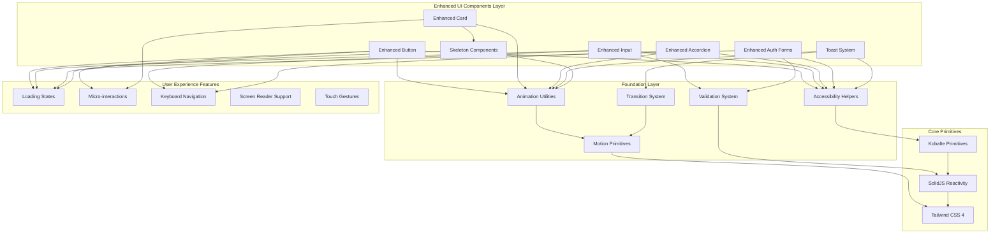
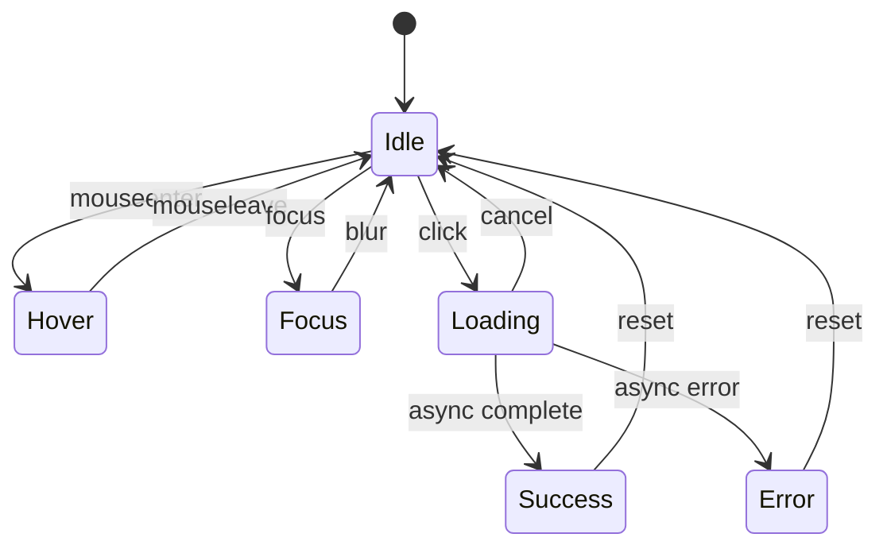
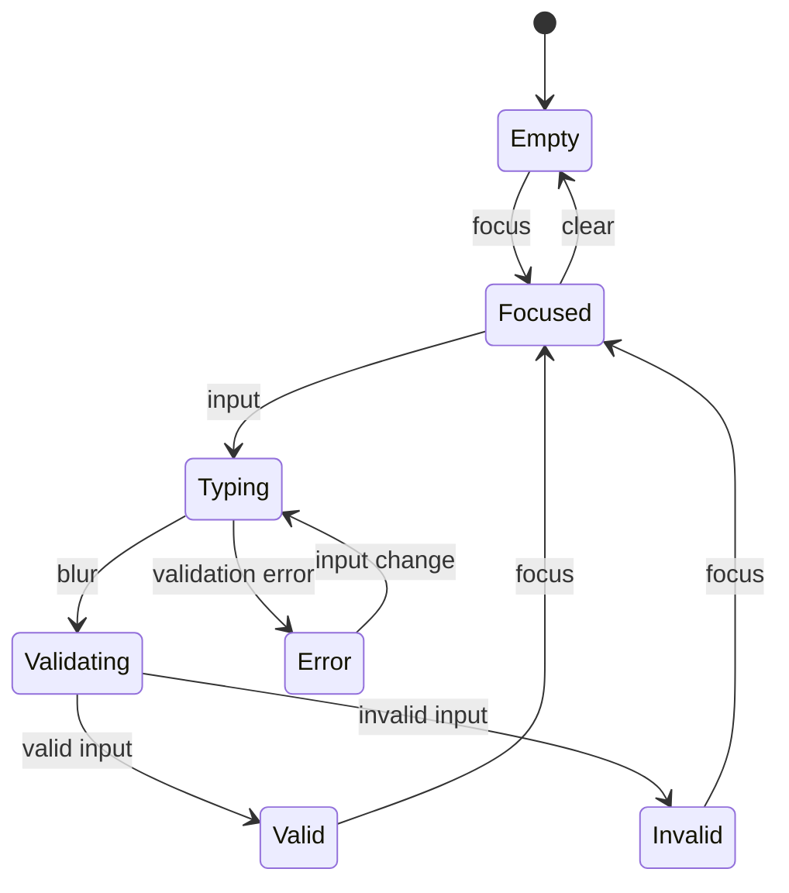
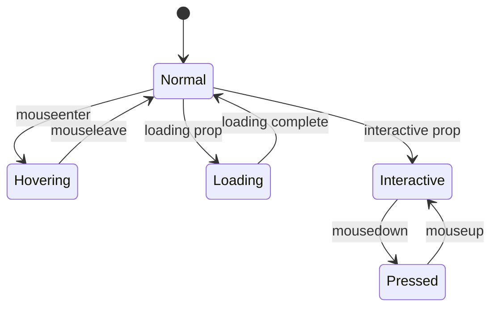
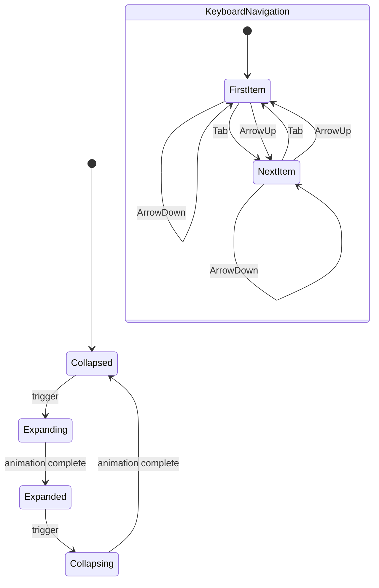
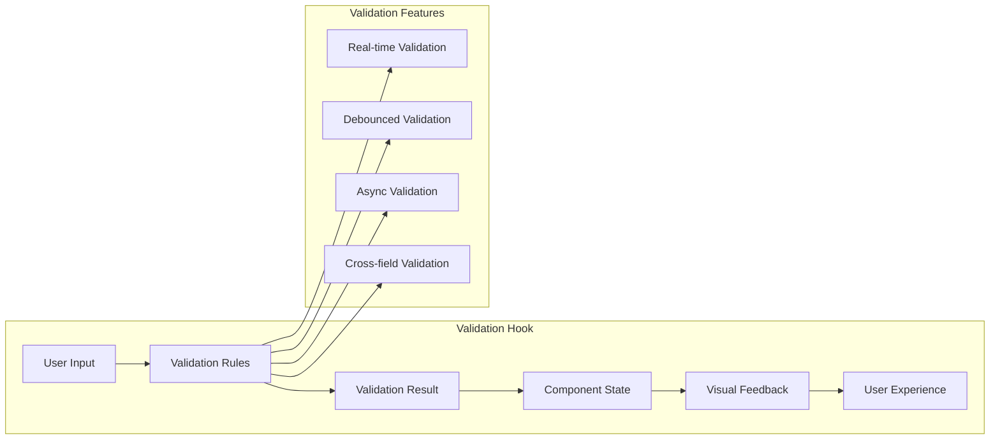
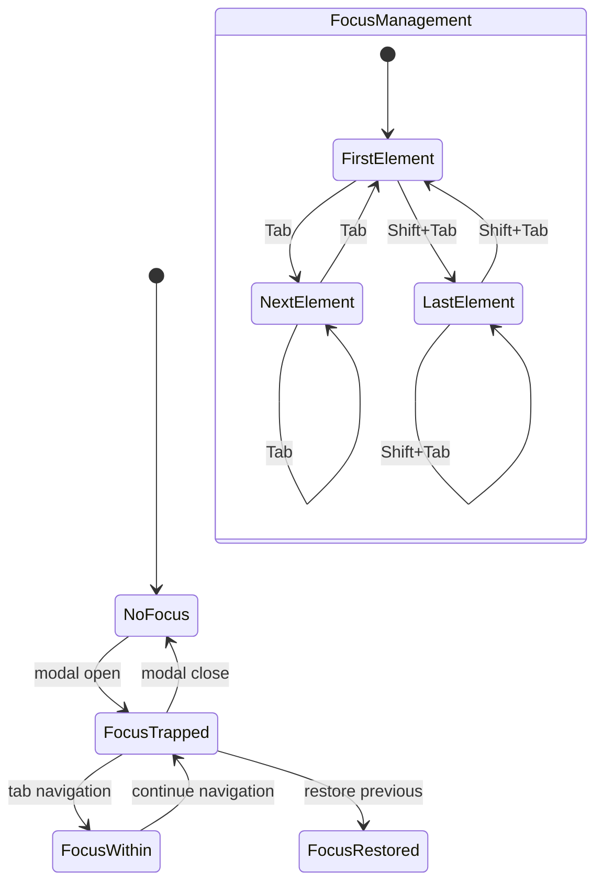
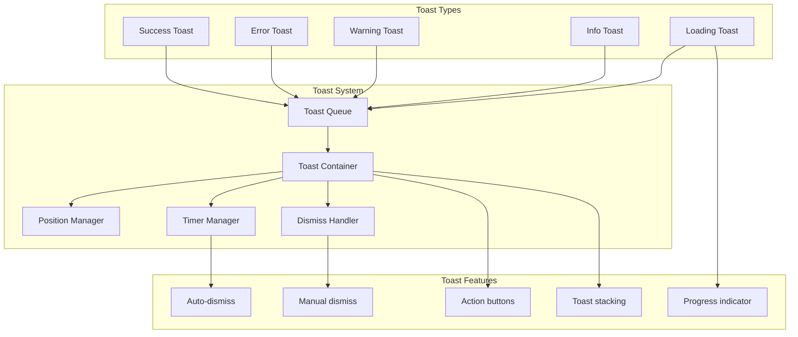
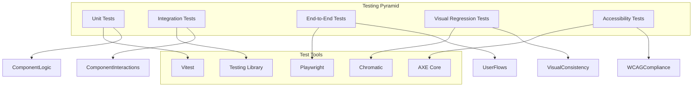

# UI Components Enhancement Architecture

## System Overview

This document outlines the architectural design for enhancing the existing UI components with advanced features, animations, and improved accessibility.

## Component Architecture Diagram



## Enhanced Component Features

### 1. Enhanced Button Component



**Features**:

- Advanced loading states with progress indicators
- Ripple effects and micro-interactions
- Icon integration with positioning
- Enhanced focus management
- Loading skeleton states
- Touch-friendly interactions

### 2. Enhanced Input Component



**Features**:

- Real-time validation with visual feedback
- Clear button functionality
- Password strength indicators
- Icon prefix/suffix support
- Character counting
- Accessibility improvements

### 3. Enhanced Card Component



**Features**:

- Hover animations and elevation changes
- Loading states with skeleton content
- Interactive card states
- Responsive behavior optimization
- Smooth transitions

### 4. Enhanced Accordion Component



**Features**:

- Smooth height animations
- Enhanced keyboard navigation
- Better focus management
- Custom trigger icons
- Progressive disclosure patterns

## Animation System Architecture

### Animation Utilities

```typescript
// Animation configuration
export const ANIMATION_CONFIG = {
  durations: {
    fast: '150ms',
    normal: '200ms',
    slow: '300ms',
  },
  easing: {
    easeIn: 'cubic-bezier(0.4, 0, 1, 1)',
    easeOut: 'cubic-bezier(0, 0, 0.2, 1)',
    easeInOut: 'cubic-bezier(0.4, 0, 0.2, 1)',
  },
  reducedMotion: {
    duration: '0ms',
    easing: 'linear',
  },
}

// Motion presets
export const MOTION_PRESETS = {
  gentle: { duration: 200, easing: 'ease-out' },
  snappy: { duration: 150, easing: 'ease-in-out' },
  bouncy: { duration: 300, easing: 'cubic-bezier(0.68, -0.55, 0.265, 1.55)' },
}
```

### Transition System

```typescript
// Transition utilities
export const TRANSITIONS = {
  scale: {
    initial: { transform: 'scale(0.95)', opacity: 0 },
    animate: { transform: 'scale(1)', opacity: 1 },
    exit: { transform: 'scale(0.95)', opacity: 0 },
  },
  slideUp: {
    initial: { transform: 'translateY(10px)', opacity: 0 },
    animate: { transform: 'translateY(0)', opacity: 1 },
    exit: { transform: 'translateY(-10px)', opacity: 0 },
  },
  fadeIn: {
    initial: { opacity: 0 },
    animate: { opacity: 1 },
    exit: { opacity: 0 },
  },
}
```

## Validation System Architecture

### Validation Rules

```typescript
export const VALIDATION_RULES = {
  email: {
    pattern: /^[^\s@]+@[^\s@]+\.[^\s@]+$/,
    message: 'Please enter a valid email address',
  },
  password: {
    minLength: { value: 8, message: 'Password must be at least 8 characters' },
    hasUppercase: {
      pattern: /[A-Z]/,
      message: 'Password must contain uppercase letter',
    },
    hasLowercase: {
      pattern: /[a-z]/,
      message: 'Password must contain lowercase letter',
    },
    hasNumbers: { pattern: /\d/, message: 'Password must contain number' },
    hasSpecialChars: {
      pattern: /[!@#$%^&*]/,
      message: 'Password must contain special character',
    },
  },
  required: {
    message: 'This field is required',
  },
}
```

### Validation Hook Architecture



## Accessibility Architecture

### ARIA Implementation

```typescript
export const ARIA_CONFIG = {
  button: {
    role: 'button',
    attributes: ['aria-expanded', 'aria-pressed', 'aria-disabled'],
  },
  input: {
    role: 'textbox',
    attributes: ['aria-required', 'aria-invalid', 'aria-describedby'],
  },
  accordion: {
    role: 'region',
    attributes: ['aria-expanded', 'aria-controls', 'aria-labelledby'],
  },
  toast: {
    role: 'alert',
    attributes: ['aria-live', 'aria-atomic'],
  },
}
```

### Focus Management



## Toast System Architecture

### Toast Management



## Performance Optimization

### Animation Performance

```typescript
export const PERFORMANCE_CONFIG = {
  // Use CSS transforms for smooth animations
  transformProperties: ['translateX', 'translateY', 'scale', 'rotate'],

  // Optimize for 60fps
  targetFPS: 60,
  frameTime: 16.67, // ms

  // Reduced motion support
  respectReducedMotion: true,

  // Hardware acceleration
  useWillChange: false, // Use judiciously

  // Debouncing for rapid interactions
  interactionDebounce: 16, // ms
}
```

### Bundle Optimization

```typescript
// Tree-shakable exports
export { Button } from './components/ui/button'
export { Input } from './components/ui/input'
export { Card } from './components/ui/card'
export { Accordion } from './components/ui/accordion'

// Conditional imports for heavy features
export const loadAnimations = async () => {
  if (typeof window !== 'undefined') {
    return import('./lib/animations')
  }
}

export const loadValidation = async () => {
  if (typeof window !== 'undefined') {
    return import('./lib/validation')
  }
}
```

## Testing Architecture

### Component Testing Strategy



## Implementation Phases

### Phase 1: Foundation (Days 1-2)

1. Create animation utilities and transition system
2. Implement skeleton loading components
3. Set up motion primitives
4. Create accessibility helpers

### Phase 2: Core Components (Days 3-4)

1. Enhance Button component with loading states
2. Improve Input component with validation
3. Add animations to Card component
4. Enhance Accordion with keyboard navigation

### Phase 3: User Feedback (Day 5)

1. Implement toast/notification system
2. Create form validation utilities
3. Enhance auth forms
4. Add comprehensive error handling

### Phase 4: Polish & Testing (Days 6-7)

1. Comprehensive accessibility testing
2. Responsive design improvements
3. Performance optimization
4. Documentation and examples

## Success Metrics

### Performance Metrics

- Animation frame rate: 60fps
- Bundle size increase: < 50KB
- First contentful paint: < 1.5s
- Interaction readiness: < 100ms

### Accessibility Metrics

- WCAG 2.1 AA compliance: 100%
- Keyboard navigability: 100%
- Screen reader compatibility: 100%
- Color contrast ratio: 4.5:1 minimum

### User Experience Metrics

- Task completion rate: > 95%
- Error rate reduction: > 50%
- User satisfaction: > 4.5/5
- Mobile usability score: > 90%

This architecture provides a comprehensive foundation for enhancing UI components with advanced features, animations, and improved accessibility while maintaining performance and code quality.
