# UI Components Implementation Plan

## Overview

This document outlines the detailed implementation plan for adding comprehensive UI components to the PEMS system, including modals, dropdowns, tables, forms, and navigation components.

## Component Architecture

```mermaid
graph TB
    subgraph "UI Component Library"
        UI[Core UI Package]
        
        subgraph "Existing Components"
            B[Button]
            C[Card]
            I[Input]
            L[Label]
            A[Accordion]
            S[Skeleton]
            T[Toast]
        end
        
        subgraph "New Components - Modals"
            M[Modal]
            MH[ModalHeader]
            MT[ModalTitle]
            MC[ModalContent]
            MF[ModalFooter]
            AD[AlertDialog]
            CD[ConfirmDialog]
            D[Dialog]
        end
        
        subgraph "New Components - Dropdowns"
            DM[DropdownMenu]
            DMT[DropdownMenuTrigger]
            DMC[DropdownMenuContent]
            DMI[DropdownMenuItem]
            DMG[DropdownMenuGroup]
            DML[DropdownMenuLabel]
            DMS[DropdownMenuSeparator]
            SEL[Select]
            CB[Combobox]
        end
        
        subgraph "New Components - Tables"
            TB[Table]
            TH[TableHeader]
            TBODY[TableBody]
            TF[TableFooter]
            TR[TableRow]
            TC[TableCell]
            TT[TableHead]
            DT[DataTable]
        end
        
        subgraph "New Components - Forms"
            F[Form]
            FF[FormField]
            FL[FormLabel]
            FD[FormDescription]
            FE[FormError]
            FM[FormMessage]
            FI[FormInput]
            FS[FormSelect]
            FC[FormCheckbox]
            FR[FormRadioGroup]
            FSW[FormSwitch]
            FTA[FormTextarea]
            FDP[FormDatePicker]
            FFU[FormFileUpload]
        end
        
        subgraph "New Components - Navigation"
            NAV[Navigation]
            NL[NavigationList]
            NI[NavigationItem]
            NLI[NavigationLink]
            NB[Navbar]
            SB[Sidebar]
            BC[Breadcrumb]
            BCI[BreadcrumbItem]
            TABS[Tabs]
            TL[TabsList]
            TT[TabsTrigger]
            TC[TabsContent]
            PAG[Pagination]
            ST[Steps]
            STEP[Step]
        end
    end
    
    subgraph "Foundation"
        K[Kobalte Primitives]
        TW[Tailwind CSS]
        CVA[Class Variance Authority]
        UT[Utils]
        ANIM[Animations]
        THEME[Theme Provider]
    end
    
    UI --> B
    UI --> C
    UI --> I
    UI --> L
    UI --> A
    UI --> S
    UI --> T
    
    UI --> M
    UI --> DM
    UI --> TB
    UI --> F
    UI --> NAV
    
    M --> MH
    M --> MT
    M --> MC
    M --> MF
    
    DM --> DMT
    DM --> DMC
    DM --> DMI
    DM --> DMG
    DM --> DML
    DM --> DMS
    
    TB --> TH
    TB --> TBODY
    TB --> TF
    TB --> TR
    TB --> TC
    TB --> TT
    
    F --> FF
    F --> FL
    F --> FD
    F --> FE
    F --> FM
    
    NAV --> NL
    NAV --> NI
    NAV --> NLI
    
    K --> UI
    TW --> UI
    CVA --> UI
    UT --> UI
    ANIM --> UI
    THEME --> UI
```



## Implementation Phases

### Phase 1: Foundation and Modal System (Week 1)

#### 1.1 Core Modal Components
- **Modal**: Base modal with overlay and focus management
- **ModalHeader**: Header section with optional close button
- **ModalTitle**: Accessible title component
- **ModalContent**: Scrollable content area
- **ModalFooter**: Action buttons area
- **ModalCloseButton**: Consistent close button

#### 1.2 Specialized Modal Variants
- **AlertDialog**: Confirmation dialogs with destructive actions
- **ConfirmDialog**: Simple yes/no confirmations
- **Dialog**: General purpose dialog with trigger

#### 1.3 Features
- Multiple size variants (sm, md, lg, xl, full)
- Animation support with reduced motion
- Keyboard navigation (ESC to close)
- Focus trapping and restoration
- Customizable close behaviors
- Backdrop click handling
- Portal rendering for proper stacking

### Phase 2: Dropdown and Menu System (Week 2)

#### 2.1 Core Dropdown Components
- **DropdownMenu**: Base menu container
- **DropdownMenuTrigger**: Trigger button with chevron
- **DropdownMenuContent**: Positioned content container
- **DropdownMenuItem**: Interactive menu items
- **DropdownMenuGroup**: Logical item groupings
- **DropdownMenuLabel**: Non-interactive labels
- **DropdownMenuSeparator**: Visual dividers

#### 2.2 Advanced Dropdown Features
- **DropdownMenuSub**: Nested submenus
- **DropdownMenuCheckboxItem**: Toggle items
- **DropdownMenuRadioGroup**: Radio button groups
- **DropdownMenuRadioItem**: Individual radio items

#### 2.3 Specialized Select Components
- **Select**: Single/multi select with search
- **Combobox**: Typeable autocomplete

#### 2.4 Features
- Positioning with collision detection
- Keyboard navigation (arrows, home, end)
- Portal rendering
- Variable menu heights
- Search/filter functionality
- Multi-select support
- Custom rendering options

### Phase 3: Table and Data Display (Week 3)

#### 3.1 Core Table Components
- **Table**: Base table with variants
- **TableHeader**: Sticky header support
- **TableBody**: Scrollable body
- **TableFooter**: Summary rows
- **TableRow**: Interactive rows
- **TableCell**: Data cells
- **TableHead**: Header cells with sorting

#### 3.2 Advanced Data Table
- **DataTable**: Full-featured data grid
- Column configuration system
- Sorting and filtering
- Pagination
- Row selection
- Expandable rows
- Bulk actions
- Virtual scrolling for large datasets

#### 3.3 Features
- Responsive design
- Sticky columns
- Row hover states
- Loading states
- Empty states
- Accessibility (ARIA tables)
- Custom cell renderers
- Export functionality

### Phase 4: Form System with Validation (Week 4)

#### 4.1 Core Form Components
- **Form**: Form container with validation
- **FormField**: Field wrapper with label/error
- **FormLabel**: Accessible labels
- **FormDescription**: Helper text
- **FormError**: Validation errors
- **FormMessage**: Status messages

#### 4.2 Form Input Components
- **FormInput**: Enhanced text input
- **FormSelect**: Dropdown selection
- **FormCheckbox**: Single checkbox
- **FormRadioGroup**: Radio button groups
- **FormSwitch**: Toggle switches
- **FormTextarea**: Multi-line text
- **FormDatePicker**: Date selection
- **FormFileUpload**: File handling

#### 4.3 Features
- Schema validation (Zod integration)
- Real-time validation
- Field dependencies
- Conditional fields
- Form state management
- Auto-save functionality
- Progress indicators
- Multi-step forms

### Phase 5: Navigation Components (Week 5)

#### 5.1 Core Navigation
- **Navigation**: Base navigation container
- **NavigationList**: List container
- **NavigationItem**: Individual items
- **NavigationLink**: Link items

#### 5.2 Layout Navigation
- **Navbar**: Top navigation bar
- **Sidebar**: Collapsible side navigation
- **Breadcrumb**: Path navigation
- **Tabs**: Tabbed content
- **Pagination**: Page navigation

#### 5.3 Step Navigation
- **Steps**: Multi-step process
- **Step**: Individual step

#### 5.4 Features
- Responsive behavior
- Mobile menus
- Active states
- Keyboard navigation
- Accessibility (ARIA landmarks)
- Smooth animations
- Sticky positioning

## Technical Implementation Details

### Component Structure

Each component follows this structure:

```
packages/ui/src/components/ui/
├── modal/
│   ├── modal.tsx
│   ├── modal-header.tsx
│   ├── modal-title.tsx
│   ├── modal-content.tsx
│   ├── modal-footer.tsx
│   ├── modal-close-button.tsx
│   ├── alert-dialog.tsx
│   ├── confirm-dialog.tsx
│   ├── dialog.tsx
│   ├── index.ts
│   └── modal.test.tsx
├── dropdown/
│   ├── dropdown-menu.tsx
│   ├── dropdown-menu-trigger.tsx
│   ├── dropdown-menu-content.tsx
│   ├── dropdown-menu-item.tsx
│   ├── dropdown-menu-group.tsx
│   ├── dropdown-menu-label.tsx
│   ├── dropdown-menu-separator.tsx
│   ├── dropdown-menu-sub.tsx
│   ├── dropdown-menu-checkbox-item.tsx
│   ├── dropdown-menu-radio-group.tsx
│   ├── dropdown-menu-radio-item.tsx
│   ├── select.tsx
│   ├── combobox.tsx
│   ├── index.ts
│   └── dropdown.test.tsx
├── table/
│   ├── table.tsx
│   ├── table-header.tsx
│   ├── table-body.tsx
│   ├── table-footer.tsx
│   ├── table-row.tsx
│   ├── table-cell.tsx
│   ├── table-head.tsx
│   ├── data-table.tsx
│   ├── index.ts
│   └── table.test.tsx
├── form/
│   ├── form.tsx
│   ├── form-field.tsx
│   ├── form-label.tsx
│   ├── form-description.tsx
│   ├── form-error.tsx
│   ├── form-message.tsx
│   ├── form-input.tsx
│   ├── form-select.tsx
│   ├── form-checkbox.tsx
│   ├── form-radio-group.tsx
│   ├── form-switch.tsx
│   ├── form-textarea.tsx
│   ├── form-date-picker.tsx
│   ├── form-file-upload.tsx
│   ├── index.ts
│   └── form.test.tsx
└── navigation/
    ├── navigation.tsx
    ├── navigation-list.tsx
    ├── navigation-item.tsx
    ├── navigation-link.tsx
    ├── navbar.tsx
    ├── sidebar.tsx
    ├── breadcrumb.tsx
    ├── breadcrumb-item.tsx
    ├── tabs.tsx
    ├── tabs-list.tsx
    ├── tabs-trigger.tsx
    ├── tabs-content.tsx
    ├── pagination.tsx
    ├── steps.tsx
    ├── step.tsx
    ├── index.ts
    └── navigation.test.tsx
```

### Implementation Patterns

#### 1. Component Template
```typescript
import type { JSX, ValidComponent } from 'solid-js'
import { Show, splitProps } from 'solid-js'
import type { PolymorphicProps } from '@kobalte/core/polymorphic'

import { useReducedMotion } from '../../lib/animations'
import { cn } from '../../lib/utils'

type ComponentProps<T extends ValidComponent = 'div'> = PolymorphicProps<T, {
  class?: string
  children?: JSX.Element
  variant?: 'default' | 'outlined' | 'ghost'
  size?: 'sm' | 'md' | 'lg'
  disabled?: boolean
}>

const Component = <T extends ValidComponent = 'div'>(
  props: PolymorphicProps<T, ComponentProps<T>>,
) => {
  const [local, others] = splitProps(props as ComponentProps, [
    'class',
    'children',
    'variant',
    'size',
    'disabled',
  ])

  const prefersReducedMotion = useReducedMotion()

  const componentVariants = cva(
    'base-classes',
    {
      variants: {
        variant: {
          default: 'default-variant-classes',
          outlined: 'outlined-variant-classes',
          ghost: 'ghost-variant-classes',
        },
        size: {
          sm: 'sm-size-classes',
          md: 'md-size-classes',
          lg: 'lg-size-classes',
        },
        disabled: {
          true: 'disabled-classes',
        },
      },
      defaultVariants: {
        variant: 'default',
        size: 'md',
      },
    },
  )

  return (
    <div
      class={cn(
        componentVariants({
          variant: local.variant,
          size: local.size,
          disabled: local.disabled,
        }),
        !prefersReducedMotion() && 'transition-all duration-200',
        local.class,
      )}
      {...others}
    >
      {local.children}
    </div>
  )
}

export { Component }
export type { ComponentProps }
```

#### 2. Testing Strategy
```typescript
import { render, screen } from '@testing-library/solid'
import { describe, expect, it } from 'vitest'
import { Component } from './component'

describe('Component', () => {
  it('renders correctly', () => {
    render(() => <Component>Test Content</Component>)
    expect(screen.getByText('Test Content')).toBeInTheDocument()
  })

  it('applies variant classes', () => {
    render(() => <Component variant="outlined">Test</Component>)
    const element = screen.getByText('Test')
    expect(element).toHaveClass('outlined-variant-classes')
  })

  it('handles click events', async () => {
    const handleClick = vi.fn()
    render(() => <Component onClick={handleClick}>Test</Component>)
    
    await userEvent.click(screen.getByText('Test'))
    expect(handleClick).toHaveBeenCalledOnce()
  })

  it('supports accessibility', () => {
    render(() => <Component aria-label="Test Component">Test</Component>)
    const element = screen.getByLabelText('Test Component')
    expect(element).toBeInTheDocument()
  })
})
```

#### 3. Documentation Pattern
```typescript
/**
 * Component description and usage.
 * 
 * @example
 * ```tsx
 * <Component variant="outlined" size="lg">
 *   Content
 * </Component>
 * ```
 */
```

### Integration Strategy

#### 1. Package Updates
- Update `packages/ui/src/index.ts` to export new components
- Add component stories to Storybook
- Update demo pages in `apps/web/src/routes/`

#### 2. Theme Integration
- Extend theme tokens for new components
- Ensure dark mode compatibility
- Add custom CSS variables for animations

#### 3. Accessibility Testing
- Automated testing with axe-core
- Manual keyboard navigation testing
- Screen reader compatibility verification

## Success Metrics

### 1. Code Quality
- 90%+ test coverage
- Zero accessibility violations
- Consistent TypeScript types
- No console errors

### 2. Performance
- Bundle size increase < 50KB
- Components render in < 16ms
- Smooth 60fps animations
- Memory usage stable

### 3. Developer Experience
- Clear documentation
- Intuitive API design
- Comprehensive examples
- Easy customization

### 4. User Experience
- Responsive design
- Keyboard navigation
- Screen reader support
- Touch-friendly interactions

## Risk Mitigation

### 1. Technical Risks
- **Bundle Size**: Implement tree-shaking and code splitting
- **Performance**: Use SolidJS reactivity efficiently
- **Compatibility**: Test across browsers and devices

### 2. Timeline Risks
- **Scope Creep**: Implement in phases with MVP first
- **Dependencies**: Use stable, well-maintained libraries
- **Testing**: Parallel development and testing

### 3. Quality Risks
- **Accessibility**: Follow WCAG 2.1 AA guidelines
- **Consistency**: Use design system tokens
- **Maintainability**: Follow established patterns

## Next Steps

1. **Phase 1 Implementation**: Start with Modal components
2. **Setup Testing**: Configure test infrastructure
3. **Documentation**: Create component documentation
4. **Integration**: Update demo applications
5. **Review**: Code review and quality assurance

This implementation plan provides a structured approach to adding comprehensive UI components while maintaining quality, performance, and accessibility standards.