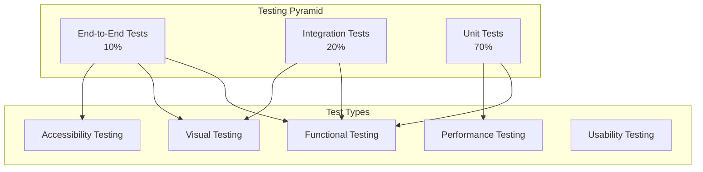

# UI Components Testing Strategy

## Overview

This document outlines a comprehensive testing strategy for enhanced UI components, ensuring reliability, accessibility, and performance across all new features and interactions.

## Testing Pyramid



## Unit Testing Strategy

### Test Framework Configuration

```typescript
// vitest.config.ts
import { defineConfig } from 'vitest/config'
import solid from 'solid-start/vite'

export default defineConfig({
  test: {
    environment: 'jsdom',
    setupFiles: ['./test/setup.ts'],
    coverage: {
      reporter: ['text', 'json', 'html'],
      exclude: ['node_modules/', 'test/', '**/*.d.ts', '**/*.stories.tsx'],
    },
  },
  plugins: [solid()],
})
```

### Component Unit Tests

#### Enhanced Button Tests

```typescript
// packages/ui/src/components/ui/button.test.tsx
import { render, screen, fireEvent, waitFor } from '@solidjs/testing-library'
import { describe, it, expect, vi } from 'vitest'
import { EnhancedButton } from './button'

describe('EnhancedButton', () => {
  it('renders with basic props', () => {
    render(() => <EnhancedButton>Click me</EnhancedButton>)

    const button = screen.getByRole('button', { name: /click me/i })
    expect(button).toBeInTheDocument()
    expect(button).toHaveAttribute('type', 'button')
  })

  it('handles click events', async () => {
    const handleClick = vi.fn()
    render(() => <EnhancedButton onClick={handleClick}>Click me</EnhancedButton>)

    const button = screen.getByRole('button')
    fireEvent.click(button)

    expect(handleClick).toHaveBeenCalledTimes(1)
  })

  it('shows loading state', async () => {
    render(() => <EnhancedButton loading>Submit</EnhancedButton>)

    const button = screen.getByRole('button')
    expect(button).toHaveAttribute('aria-busy', 'true')
    expect(button).toBeDisabled()

    // Check for loading spinner
    const spinner = button.querySelector('.animate-spin')
    expect(spinner).toBeInTheDocument()
  })

  it('shows ripple effect when enabled', async () => {
    render(() => <EnhancedButton ripple>Click me</EnhancedButton>)

    const button = screen.getByRole('button')
    fireEvent.click(button, { clientX: 10, clientY: 10 })

    // Check for ripple element
    const ripple = button.querySelector('[class*="animate-ping"]')
    expect(ripple).toBeInTheDocument()
  })

  it('handles confirm mode', async () => {
    const handleClick = vi.fn()
    render(() => (
      <EnhancedButton confirmMode confirmText="Confirm?" onClick={handleClick}>
        Delete
      </EnhancedButton>
    ))

    const button = screen.getByRole('button')
    fireEvent.click(button)

    // Should show confirm text
    expect(screen.getByText('Confirm?')).toBeInTheDocument()
    expect(handleClick).not.toHaveBeenCalled()

    // Second click should trigger handler
    fireEvent.click(button)
    expect(handleClick).toHaveBeenCalledTimes(1)
  })

  it('respects reduced motion preference', async () => {
    // Mock prefers-reduced-motion
    Object.defineProperty(window, 'matchMedia', {
      writable: true,
      value: vi.fn().mockImplementation(query => ({
        matches: query === '(prefers-reduced-motion: reduce)',
        addEventListener: vi.fn(),
        removeEventListener: vi.fn(),
      })),
    })

    render(() => <EnhancedButton ripple>Click me</EnhancedButton>)

    const button = screen.getByRole('button')
    fireEvent.click(button)

    // Should not create ripple when reduced motion is preferred
    const ripple = button.querySelector('[class*="animate-ping"]')
    expect(ripple).not.toBeInTheDocument()
  })
})
```

#### Enhanced Input Tests

```typescript
// packages/ui/src/components/ui/input.test.tsx
import { render, screen, fireEvent, waitFor } from '@solidjs/testing-library'
import { describe, it, expect, vi } from 'vitest'
import { EnhancedInput } from './input'

describe('EnhancedInput', () => {
  it('renders with basic props', () => {
    render(() => <EnhancedInput placeholder="Enter text" />)

    const input = screen.getByPlaceholderText(/enter text/i)
    expect(input).toBeInTheDocument()
    expect(input).toHaveAttribute('type', 'text')
  })

  it('handles validation', async () => {
    const validator = vi.fn().mockReturnValue({
      isValid: false,
      message: 'Invalid email'
    })

    render(() => (
      <EnhancedInput
        validator={validator}
        validateOnChange
        placeholder="Email"
      />
    ))

    const input = screen.getByPlaceholderText(/email/i)
    fireEvent.input(input, { target: { value: 'invalid-email' } })

    await waitFor(() => {
      expect(validator).toHaveBeenCalledWith('invalid-email')
      expect(screen.getByText('Invalid email')).toBeInTheDocument()
    })
  })

  it('shows character count', async () => {
    render(() => (
      <EnhancedInput
        maxLength={10}
        showCharacterCount
        placeholder="Text"
      />
    ))

    const input = screen.getByPlaceholderText(/text/i)
    fireEvent.input(input, { target: { value: 'hello' } })

    expect(screen.getByText('5/10')).toBeInTheDocument()
  })

  it('handles clear button', async () => {
    const onClear = vi.fn()
    render(() => (
      <EnhancedInput
        clearable
        onClear={onClear}
        placeholder="Text"
      />
    ))

    const input = screen.getByPlaceholderText(/text/i)
    fireEvent.input(input, { target: { value: 'hello' } })

    const clearButton = screen.getByRole('button', { name: /clear input/i })
    fireEvent.click(clearButton)

    expect(input).toHaveValue('')
    expect(onClear).toHaveBeenCalledTimes(1)
  })

  it('handles password toggle', async () => {
    render(() => (
      <EnhancedInput
        type="password"
        showPasswordToggle
        placeholder="Password"
      />
    ))

    const input = screen.getByPlaceholderText(/password/i)
    expect(input).toHaveAttribute('type', 'password')

    const toggleButton = screen.getByRole('button', { name: /show password/i })
    fireEvent.click(toggleButton)

    expect(input).toHaveAttribute('type', 'text')
  })

  it('respects accessibility attributes', () => {
    render(() => (
      <EnhancedInput
        ariaLabel="Email address"
        ariaDescribedBy="email-help"
        ariaInvalid={true}
        ariaErrorMessage="email-error"
        placeholder="Email"
      />
    ))

    const input = screen.getByPlaceholderText(/email/i)
    expect(input).toHaveAttribute('aria-label', 'Email address')
    expect(input).toHaveAttribute('aria-describedby', 'email-help')
    expect(input).toHaveAttribute('aria-invalid', 'true')
    expect(input).toHaveAttribute('aria-errormessage', 'email-error')
  })
})
```

## Integration Testing Strategy

### Component Interaction Tests

```typescript
// packages/ui/src/components/integration/form-interactions.test.tsx
import { render, screen, fireEvent, waitFor } from '@solidjs/testing-library'
import { describe, it, expect, vi } from 'vitest'
import { EnhancedForm } from './enhanced-form'

describe('Form Interactions', () => {
  it('handles form submission with validation', async () => {
    const handleSubmit = vi.fn()

    render(() => (
      <EnhancedForm onSubmit={handleSubmit}>
        <EnhancedInput
          name="email"
          type="email"
          validator={(value) => ({
            isValid: /^[^\s@]+@[^\s@]+\.[^\s@]+$/.test(value),
            message: 'Invalid email'
          })}
          validateOnChange
          required
        />
        <EnhancedInput
          name="password"
          type="password"
          validator={(value) => ({
            isValid: value.length >= 8,
            message: 'Password too short'
          })}
          validateOnChange
          required
        />
        <EnhancedButton type="submit">Submit</EnhancedButton>
      </EnhancedForm>
    ))

    // Submit without filling form
    const submitButton = screen.getByRole('button', { name: /submit/i })
    fireEvent.click(submitButton)

    // Should show validation errors
    await waitFor(() => {
      expect(screen.getByText('Invalid email')).toBeInTheDocument()
      expect(screen.getByText('Password too short')).toBeInTheDocument()
    })

    expect(handleSubmit).not.toHaveBeenCalled()

    // Fill form correctly
    fireEvent.input(screen.getByPlaceholderText(/email/i), {
      target: { value: 'test@example.com' }
    })
    fireEvent.input(screen.getByPlaceholderText(/password/i), {
      target: { value: 'password123' }
    })

    // Submit valid form
    fireEvent.click(submitButton)

    await waitFor(() => {
      expect(handleSubmit).toHaveBeenCalledWith({
        email: 'test@example.com',
        password: 'password123'
      })
    })
  })
})
```

## Accessibility Testing Strategy

### Automated Accessibility Tests

```typescript
// packages/ui/src/components/accessibility/accessibility.test.tsx
import { render, screen, fireEvent } from '@solidjs/testing-library'
import { describe, it, expect } from 'vitest'
import { axe, toHaveNoViolations } from 'jest-axe'
import { EnhancedButton, EnhancedInput, EnhancedCard } from '../ui'

expect.extend(toHaveNoViolations)

describe('Accessibility', () => {
  it('Button should be accessible', async () => {
    const { container } = render(() => (
      <EnhancedButton ariaLabel="Submit form">Submit</EnhancedButton>
    ))

    const results = await axe(container)
    expect(results).toHaveNoViolations()
  })

  it('Input should be accessible', async () => {
    const { container } = render(() => (
      <EnhancedInput
        ariaLabel="Email address"
        ariaDescribedBy="email-help"
        placeholder="Enter email"
      />
    ))

    const results = await axe(container)
    expect(results).toHaveNoViolations()
  })

  it('Card should be accessible', async () => {
    const { container } = render(() => (
      <EnhancedCard role="article">
        <h3>Card Title</h3>
        <p>Card content</p>
      </EnhancedCard>
    ))

    const results = await axe(container)
    expect(results).toHaveNoViolations()
  })
})
```

### Keyboard Navigation Tests

```typescript
// packages/ui/src/components/accessibility/keyboard-navigation.test.tsx
import { render, screen, fireEvent } from '@solidjs/testing-library'
import { describe, it, expect } from 'vitest'
import { EnhancedAccordion } from '../accordion'

describe('Keyboard Navigation', () => {
  it('Accordion should be keyboard navigable', () => {
    render(() => (
      <EnhancedAccordion>
        <EnhancedAccordionItem value="item1">
          <EnhancedAccordionTrigger>Section 1</EnhancedAccordionTrigger>
          <EnhancedAccordionTrigger>Content 1</EnhancedAccordionTrigger>
        </EnhancedAccordionItem>
        <EnhancedAccordionItem value="item2">
          <EnhancedAccordionTrigger>Section 2</EnhancedAccordionTrigger>
          <EnhancedAccordionTrigger>Content 2</EnhancedAccordionTrigger>
        </EnhancedAccordionItem>
      </EnhancedAccordion>
    ))

    const trigger1 = screen.getByRole('button', { name: /section 1/i })
    const trigger2 = screen.getByRole('button', { name: /section 2/i })

    // Tab to first trigger
    fireEvent.tab()
    expect(trigger1).toHaveFocus()

    // Tab to second trigger
    fireEvent.tab()
    expect(trigger2).toHaveFocus()

    // Enter should expand second section
    fireEvent.keyDown(trigger2, { key: 'Enter' })
    expect(trigger2).toHaveAttribute('aria-expanded', 'true')

    // Arrow keys should navigate
    fireEvent.keyDown(trigger2, { key: 'ArrowUp' })
    expect(trigger1).toHaveFocus()

    fireEvent.keyDown(trigger1, { key: 'ArrowDown' })
    expect(trigger2).toHaveFocus()
  })
})
```

## Visual Testing Strategy

### Visual Regression Tests

```typescript
// packages/ui/src/components/visual/visual-regression.test.tsx
import { render, screen } from '@solidjs/testing-library'
import { describe, it, expect } from 'vitest'
import { EnhancedButton } from '../button'

describe('Visual Regression', () => {
  it('Button matches snapshot', async () => {
    const { container } = render(() => (
      <EnhancedButton variant="primary" size="lg">
        Click me
      </EnhancedButton>
    ))

    expect(container).toMatchSnapshot()
  })

  it('Button loading state matches snapshot', async () => {
    const { container } = render(() => (
      <EnhancedButton loading loadingText="Loading...">
        Click me
      </EnhancedButton>
    ))

    expect(container).toMatchSnapshot()
  })

  it('Button with ripple effect matches snapshot', async () => {
    const { container } = render(() => (
      <EnhancedButton ripple>
        Click me
      </EnhancedButton>
    ))

    const button = screen.getByRole('button')
    fireEvent.click(button, { clientX: 10, clientY: 10 })

    expect(container).toMatchSnapshot()
  })
})
```

## Performance Testing Strategy

### Animation Performance Tests

```typescript
// packages/ui/src/components/performance/animation-performance.test.tsx
import { render, screen, fireEvent } from '@solidjs/testing-library'
import { describe, it, expect } from 'vitest'
import { EnhancedButton } from '../button'

describe('Performance', () => {
  it('Button animations should maintain 60fps', async () => {
    const { container } = render(() => (
      <EnhancedButton ripple>Click me</EnhancedButton>
    ))

    const button = screen.getByRole('button')
    const frameCount = 60
    const targetFrameTime = 16.67 // 60fps = 16.67ms per frame

    const startTime = performance.now()

    // Simulate rapid clicks
    for (let i = 0; i < frameCount; i++) {
      fireEvent.click(button, { clientX: 10 + i, clientY: 10 + i })
      await new Promise(resolve => setTimeout(resolve, targetFrameTime))
    }

    const endTime = performance.now()
    const totalTime = endTime - startTime
    const averageFrameTime = totalTime / frameCount

    // Should maintain close to 60fps (within 10% tolerance)
    expect(averageFrameTime).toBeLessThan(targetFrameTime * 1.1)
  })

  it('Component should not cause memory leaks', async () => {
    const initialMemory = performance.memory?.usedJSHeapSize || 0

    // Render and unmount components multiple times
    for (let i = 0; i < 100; i++) {
      const { unmount } = render(() => <EnhancedButton>Button {i}</EnhancedButton>)
      unmount()
    }

    // Force garbage collection if available
    if (global.gc) {
      global.gc()
    }

    const finalMemory = performance.memory?.usedJSHeapSize || 0
    const memoryIncrease = finalMemory - initialMemory

    // Memory increase should be minimal (< 1MB)
    expect(memoryIncrease).toBeLessThan(1024 * 1024)
  })
})
```

## End-to-End Testing Strategy

### User Flow Tests

```typescript
// e2e/auth-flow.spec.ts
import { test, expect } from '@playwright/test'

test.describe('Authentication Flow', () => {
  test('user can login with valid credentials', async ({ page }) => {
    await page.goto('/login')

    // Fill login form
    await page.fill('[data-testid="email-input"]', 'user@example.com')
    await page.fill('[data-testid="password-input"]', 'password123')

    // Submit form
    await page.click('[data-testid="login-button"]')

    // Should show loading state
    await expect(page.locator('[data-testid="login-button"]')).toHaveAttribute(
      'aria-busy',
      'true',
    )

    // Should redirect to dashboard
    await expect(page).toHaveURL('/dashboard')

    // Should show success toast
    await expect(page.locator('[data-testid="toast-success"]')).toBeVisible()
  })

  test('user sees validation errors with invalid credentials', async ({
    page,
  }) => {
    await page.goto('/login')

    // Submit empty form
    await page.click('[data-testid="login-button"]')

    // Should show validation errors
    await expect(page.locator('[data-testid="email-error"]')).toBeVisible()
    await expect(page.locator('[data-testid="password-error"]')).toBeVisible()

    // Fill with invalid email
    await page.fill('[data-testid="email-input"]', 'invalid-email')
    await page.blur('[data-testid="email-input"]')

    // Should show email validation error
    await expect(page.locator('[data-testid="email-error"]')).toContainText(
      'Invalid email',
    )
  })

  test('form is keyboard accessible', async ({ page }) => {
    await page.goto('/login')

    // Tab through form fields
    await page.keyboard.press('Tab')
    await expect(page.locator('[data-testid="email-input"]')).toBeFocused()

    await page.keyboard.press('Tab')
    await expect(page.locator('[data-testid="password-input"]')).toBeFocused()

    await page.keyboard.press('Tab')
    await expect(page.locator('[data-testid="login-button"]')).toBeFocused()

    // Submit with Enter key
    await page.keyboard.press('Enter')

    // Should attempt submission
    await expect(page.locator('[data-testid="login-button"]')).toHaveAttribute(
      'aria-busy',
      'true',
    )
  })
})
```

## Test Configuration

### Vitest Configuration

```typescript
// vitest.integration.config.ts
import { defineConfig } from 'vitest/config'
import solid from 'solid-start/vite'

export default defineConfig({
  test: {
    environment: 'jsdom',
    setupFiles: ['./test/integration.setup.ts'],
    include: ['**/*.integration.test.tsx'],
    globals: true,
  },
  plugins: [solid()],
})
```

### Playwright Configuration

```typescript
// playwright.config.ts
import { defineConfig, devices } from '@playwright/test'

export default defineConfig({
  testDir: './e2e',
  fullyParallel: true,
  forbidOnly: !!process.env.CI,
  retries: process.env.CI ? 2 : 0,
  workers: process.env.CI ? 1 : undefined,
  reporter: 'html',
  use: {
    baseURL: 'http://localhost:3000',
    trace: 'on-first-retry',
    screenshot: 'only-on-failure',
    video: 'retain-on-failure',
  },
  projects: [
    {
      name: 'chromium',
      use: { ...devices['Desktop Chrome'] },
    },
    {
      name: 'firefox',
      use: { ...devices['Desktop Firefox'] },
    },
    {
      name: 'webkit',
      use: { ...devices['Desktop Safari'] },
    },
    {
      name: 'Mobile Chrome',
      use: { ...devices['Pixel 5'] },
    },
  ],
  webServer: {
    command: 'npm run dev',
    url: 'http://localhost:3000',
    reuseExistingServer: !process.env.CI,
  },
})
```

## Continuous Integration

### GitHub Actions Workflow

```yaml
# .github/workflows/ui-components-test.yml
name: UI Components Test

on:
  push:
    branches: [main, develop]
    paths: ['packages/ui/**']
  pull_request:
    branches: [main]
    paths: ['packages/ui/**']

jobs:
  unit-tests:
    runs-on: ubuntu-latest
    steps:
      - uses: actions/checkout@v3
      - uses: actions/setup-node@v3
        with:
          node-version: '18'
          cache: 'npm'

      - run: npm ci
      - run: npm run test:unit
      - run: npm run test:coverage

      - name: Upload coverage
        uses: codecov/codecov-action@v3

  accessibility-tests:
    runs-on: ubuntu-latest
    steps:
      - uses: actions/checkout@v3
      - uses: actions/setup-node@v3
        with:
          node-version: '18'
          cache: 'npm'

      - run: npm ci
      - run: npm run test:accessibility

      - name: Upload accessibility report
        uses: actions/upload-artifact@v3
        with:
          name: accessibility-report
          path: accessibility-report/

  visual-tests:
    runs-on: ubuntu-latest
    steps:
      - uses: actions/checkout@v3
      - uses: actions/setup-node@v3
        with:
          node-version: '18'
          cache: 'npm'

      - run: npm ci
      - run: npm run test:visual

      - name: Upload visual diff
        uses: actions/upload-artifact@v3
        with:
          name: visual-diff
          path: visual-diff/

  e2e-tests:
    runs-on: ubuntu-latest
    steps:
      - uses: actions/checkout@v3
      - uses: actions/setup-node@v3
        with:
          node-version: '18'
          cache: 'npm'

      - run: npm ci
      - run: npm run build
      - run: npm run test:e2e

      - name: Upload E2E report
        uses: actions/upload-artifact@v3
        with:
          name: e2e-report
          path: playwright-report/
```

## Success Metrics

### Coverage Requirements

- **Unit Test Coverage**: ≥ 90%
- **Integration Test Coverage**: ≥ 80%
- **E2E Test Coverage**: ≥ 70%
- **Accessibility Coverage**: 100% (WCAG 2.1 AA)

### Performance Requirements

- **Animation Frame Rate**: ≥ 55fps
- **Component Render Time**: ≤ 16ms
- **Memory Usage**: ≤ 10MB increase per component
- **Bundle Size**: ≤ 50KB increase total

### Quality Requirements

- **Zero Critical Accessibility Violations**
- **Zero High Severity Security Issues**
- **All Critical User Paths Tested**
- **Cross-Browser Compatibility**: Chrome, Firefox, Safari, Edge

This comprehensive testing strategy ensures enhanced UI components are reliable, accessible, and performant across all use cases and environments.
