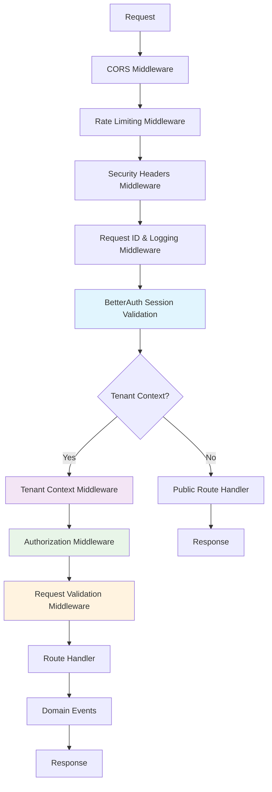

# Week 3: API Routes and Middleware Security - Implementation Plan

## Executive Summary

This document outlines the comprehensive implementation plan for Week 3, focusing on enhancing API routes and middleware security for the PEMS system. The plan addresses critical gaps in authentication, authorization, and security middleware while building upon the existing Domain-Driven Design foundation.

## Current State Analysis

### Existing Infrastructure

- **Basic tenant context middleware** with mock authentication
- **BetterAuth 1.4.3** installed but not properly integrated
- **RBAC system** defined but not implemented in middleware
- **Tenant management routes** with good patterns established
- **User management domain** logic complete but missing API routes
- **Basic CORS configuration** and simple error handling

### Identified Gaps

1. **Authentication**: Mock authentication in tenant context middleware
2. **Session Management**: No proper BetterAuth session validation
3. **Authorization**: RBAC defined but not enforced
4. **Security**: Missing rate limiting, security headers, input validation
5. **API Routes**: User management routes missing
6. **Error Handling**: Basic error handling without proper logging

## Enhanced Authentication Middleware Architecture



## Implementation Phases

### Phase 1: Core Authentication Enhancement

#### 1.1 BetterAuth Session Validation Middleware

**Objective**: Replace mock authentication with real BetterAuth integration

**Implementation Details**:

- Create `authMiddleware` that validates BetterAuth sessions
- Integrate with existing tenant context middleware
- Handle session refresh and expiration
- Support multiple authentication methods (email/password, social providers)

**Files to Create/Modify**:

- `packages/infrastructure/middleware/src/auth-middleware.ts`
- `packages/infrastructure/middleware/src/index.ts`

**Key Features**:

```typescript
export const authMiddleware = (options?: AuthMiddlewareOptions) => {
  return async (c: Context, next: Next) => {
    const sessionToken = extractSessionToken(c)
    if (!sessionToken) {
      throw new HTTPException(401, { message: 'No session token provided' })
    }

    const session = await auth.validateSession(sessionToken)
    if (!session || !session.user) {
      throw new HTTPException(401, { message: 'Invalid or expired session' })
    }

    // Set user context
    c.set(USER_CONTEXT_KEY, session.user)
    c.set(SESSION_CONTEXT_KEY, session)

    await next()
  }
}
```

#### 1.2 Enhanced Tenant Context Middleware

**Objective**: Remove mock authentication and integrate with BetterAuth

**Implementation Details**:

- Remove mock authentication logic from `tenant-context.ts`
- Integrate with BetterAuth user sessions
- Improve error handling and validation
- Support cross-tenant admin access

**Key Changes**:

- Replace `extractAuthPayload` with BetterAuth session validation
- Enhance tenant verification with user-tenant relationships
- Add proper error handling for invalid tenants

### Phase 2: Security Middleware Stack

#### 2.1 Rate Limiting Middleware

**Objective**: Implement Redis-based rate limiting for API protection

**Implementation Details**:

- Redis-based rate limiting with configurable limits
- IP-based and user-based limiting
- Route-specific rate limit configurations
- Graceful degradation when Redis is unavailable

**Files to Create**:

- `packages/infrastructure/middleware/src/rate-limit-middleware.ts`

**Configuration**:

```typescript
interface RateLimitConfig {
  windowMs: number // Time window in milliseconds
  max: number // Max requests per window
  message?: string // Custom error message
  keyGenerator?: (c: Context) => string // Custom key generation
  skipSuccessfulRequests?: boolean
  skipFailedRequests?: boolean
}

// Default configurations
const DEFAULT_LIMITS = {
  auth: { windowMs: 15 * 60 * 1000, max: 5 }, // 5 requests per 15 minutes
  general: { windowMs: 15 * 60 * 1000, max: 100 }, // 100 requests per 15 minutes
  upload: { windowMs: 60 * 1000, max: 10 }, // 10 requests per minute
}
```

#### 2.2 Enhanced CORS Configuration

**Objective**: Environment-specific CORS with security focus

**Implementation Details**:

- Environment-specific CORS settings
- Support for multiple frontend domains
- Development vs production configurations
- Security-focused defaults

**Files to Modify**:

- `apps/api/src/server.ts`

#### 2.3 Security Headers Middleware

**Objective**: Implement OWASP-recommended security headers

**Implementation Details**:

- Content Security Policy (CSP)
- HTTP Strict Transport Security (HSTS)
- X-Frame-Options, X-Content-Type-Options
- Referrer-Policy, Permissions-Policy

**Files to Create**:

- `packages/infrastructure/middleware/src/security-headers-middleware.ts`

### Phase 3: Authorization & Validation

#### 3.1 Authorization Middleware

**Objective**: Implement RBAC using existing permission system

**Implementation Details**:

- Route-level permission checks
- Tenant-aware authorization
- Support for multiple roles per user
- Permission inheritance and scope

**Files to Create**:

- `packages/infrastructure/middleware/src/authorization-middleware.ts`

**Usage Pattern**:

```typescript
// Apply to routes requiring specific permissions
app.use('/api/users', requirePermission('users:read'))
app.use('/api/users', requirePermission('users:create'))

// Apply to routes requiring any of multiple permissions
app.use('/api/admin', requireAnyPermission(['users:manage', 'tenants:manage']))

// Apply to routes requiring all permissions
app.use(
  '/api/super-admin',
  requireAllPermissions(['system:config', 'system:audit']),
)
```

#### 3.2 Request Validation Middleware

**Objective**: Zod-based automatic request/response validation

**Implementation Details**:

- Integration with Hono's zValidator
- Automatic error formatting
- Request and response schema validation
- Custom validation error messages

**Files to Create**:

- `packages/infrastructure/middleware/src/validation-middleware.ts`

### Phase 4: API Routes & Error Handling

#### 4.1 User Management API Routes

**Objective**: Create comprehensive CRUD API for user management

**Implementation Details**:

- Follow existing tenant management route patterns
- Implement all user service operations
- Authentication endpoints (login, register, logout)
- MFA endpoints
- Profile management

**Files to Create**:

- `modules/user-management/src/presentation/user-controller.ts`
- `modules/user-management/src/presentation/auth-controller.ts`

**Route Structure**:

```
/api/auth/
  POST /login
  POST /register
  POST /logout
  POST /refresh
  POST /forgot-password
  POST /reset-password
  POST /mfa/setup
  POST /mfa/verify
  POST /mfa/disable

/api/users/
  GET /users
  POST /users
  GET /users/:id
  PUT /users/:id
  DELETE /users/:id
  GET /users/profile
  PUT /users/profile
  POST /users/change-password
```

#### 4.2 Enhanced Error Handling & Logging

**Objective**: Structured error responses and comprehensive logging

**Implementation Details**:

- Request correlation IDs
- Structured error responses
- Comprehensive logging with different levels
- Error monitoring integration

**Files to Create**:

- `packages/infrastructure/middleware/src/error-handling-middleware.ts`
- `packages/infrastructure/middleware/src/request-logging-middleware.ts`

### Phase 5: Documentation & Testing

#### 5.1 API Documentation

**Objective**: Comprehensive API documentation with examples

**Implementation Details**:

- OpenAPI/Swagger documentation
- Route-level documentation
- Authentication examples
- Interactive API explorer

#### 5.2 Integration Testing

**Objective**: Comprehensive testing of middleware and routes

**Implementation Details**:

- Middleware stack testing
- End-to-end API testing
- Security testing
- Performance testing

## Technical Specifications

### Dependencies to Add

```json
{
  "@hono/zod-validator": "^0.3.0",
  "ioredis": "^5.3.2",
  "helmet": "^7.1.0",
  "express-rate-limit": "^7.1.5",
  "zod": "^3.24.1",
  "nanoid": "^5.0.4",
  "@types/express-rate-limit": "^6.0.2"
}
```

### Middleware Stack Configuration

```typescript
// apps/api/src/server.ts - Enhanced middleware stack
import { cors } from 'hono/cors'
import { authMiddleware } from '@pems/middleware'
import { rateLimitMiddleware } from '@pems/middleware'
import { securityHeadersMiddleware } from '@pems/middleware'
import { requestIdMiddleware } from '@pems/middleware'
import { requestLoggingMiddleware } from '@pems/middleware'
import { tenantContextMiddleware } from '@pems/middleware'
import { authorizationMiddleware } from '@pems/middleware'
import { validationMiddleware } from '@pems/middleware'

// Global middleware (execution order matters)
app.use('*', cors(config.cors))
app.use('*', securityHeadersMiddleware(config.security))
app.use('*', requestIdMiddleware())
app.use('*', requestLoggingMiddleware(config.logging))
app.use('*', rateLimitMiddleware(config.rateLimit))

// Authentication middleware for protected routes
app.use('/api/*', authMiddleware(config.auth))

// Tenant context for API routes
app.use('/api/*', tenantContextMiddleware(prisma))

// Authorization for protected routes
app.use('/api/*', authorizationMiddleware())

// Validation for API routes
app.use('/api/*', validationMiddleware())
```

### Environment Configuration

```env
# Rate Limiting
REDIS_URL=redis://localhost:6379
RATE_LIMIT_WINDOW_MS=900000
RATE_LIMIT_MAX_REQUESTS=100

# Security
CORS_ORIGIN=http://localhost:3000,http://localhost:3001
SECURITY_HEADERS_ENABLED=true
CSP_ENABLED=true

# Authentication
SESSION_SECRET=your-session-secret
JWT_SECRET=your-jwt-secret
PASSWORD_RESET_EXPIRY=3600000
MFA_ISSUER=PEMS

# Logging
LOG_LEVEL=info
REQUEST_LOGGING_ENABLED=true
ERROR_LOGGING_ENABLED=true
```

## Database Schema Updates

### Additional Tables for Enhanced Authentication

```sql
-- Password reset tokens
CREATE TABLE password_reset_tokens (
    id UUID PRIMARY KEY DEFAULT uuidv7(),
    user_id UUID NOT NULL REFERENCES users(id),
    token VARCHAR(255) NOT NULL UNIQUE,
    expires_at TIMESTAMP NOT NULL,
    created_at TIMESTAMP DEFAULT NOW(),
    used_at TIMESTAMP NULL
);

-- Magic link tokens
CREATE TABLE magic_link_tokens (
    id UUID PRIMARY KEY DEFAULT uuidv7(),
    user_id UUID NOT NULL REFERENCES users(id),
    token VARCHAR(255) NOT NULL UNIQUE,
    expires_at TIMESTAMP NOT NULL,
    created_at TIMESTAMP DEFAULT NOW(),
    used_at TIMESTAMP NULL
);

-- User sessions (BetterAuth integration)
CREATE TABLE user_sessions (
    id UUID PRIMARY KEY DEFAULT uuidv7(),
    user_id UUID NOT NULL REFERENCES users(id),
    token VARCHAR(255) NOT NULL UNIQUE,
    expires_at TIMESTAMP NOT NULL,
    created_at TIMESTAMP DEFAULT NOW(),
    last_used_at TIMESTAMP DEFAULT NOW(),
    ip_address INET,
    user_agent TEXT
);

-- Update user_auth_providers to support MFA
ALTER TABLE user_auth_providers
ADD COLUMN mfa_secret VARCHAR(255),
ADD COLUMN backup_codes JSON,
ADD COLUMN mfa_enabled BOOLEAN DEFAULT FALSE;
```

## Security Considerations

### Authentication Security

- **Password Requirements**: Enforce strong password policies
- **Session Management**: Secure session handling with proper expiration
- **MFA Support**: TOTP-based multi-factor authentication
- **Rate Limiting**: Prevent brute force attacks

### Authorization Security

- **Principle of Least Privilege**: Minimum required permissions
- **Tenant Isolation**: Strict data separation between tenants
- **Role-Based Access**: Proper role hierarchy and permissions
- **Audit Logging**: Track all access and modifications

### API Security

- **Input Validation**: Comprehensive request validation
- **SQL Injection Prevention**: Parameterized queries and ORM usage
- **XSS Prevention**: Proper output encoding and CSP headers
- **CSRF Protection**: CSRF tokens and secure headers

## Performance Considerations

### Middleware Optimization

- **Lazy Loading**: Load middleware only when needed
- **Caching**: Cache frequently accessed data
- **Connection Pooling**: Optimize database connections
- **Async Operations**: Non-blocking middleware operations

### Rate Limiting Strategy

- **Redis Clustering**: Scalable rate limiting
- **Sliding Window**: More accurate rate limiting
- **Burst Protection**: Handle traffic spikes
- **Graceful Degradation**: Fallback when Redis unavailable

## Testing Strategy

### Unit Tests

- Middleware function testing
- Authentication flow testing
- Authorization logic testing
- Validation schema testing

### Integration Tests

- End-to-end API testing
- Middleware stack testing
- Database integration testing
- Redis integration testing

### Security Tests

- Authentication bypass testing
- Authorization escalation testing
- Input validation testing
- Rate limiting effectiveness testing

## Success Criteria

### Functional Requirements

- [ ] BetterAuth fully integrated with session validation
- [ ] Comprehensive user management API routes
- [ ] RBAC authorization enforced on all protected routes
- [ ] Rate limiting prevents abuse
- [ ] Security headers properly configured
- [ ] Request validation prevents invalid data

### Non-Functional Requirements

- [ ] API response time < 200ms for authentication
- [ ] Zero security vulnerabilities in OWASP testing
- [ ] 99.9% uptime for authentication services
- [ ] Comprehensive audit logging for all operations
- [ ] Proper error handling and user feedback

## Implementation Timeline

### Week 1: Core Authentication

- Day 1-2: BetterAuth session validation middleware
- Day 3-4: Enhanced tenant context middleware
- Day 5: Integration testing and documentation

### Week 2: Security Stack

- Day 1-2: Rate limiting middleware
- Day 3: Enhanced CORS and security headers
- Day 4: Authorization middleware
- Day 5: Request validation middleware

### Week 3: API Routes & Testing

- Day 1-3: User management API routes
- Day 4: Error handling and logging
- Day 5: Integration testing and documentation

## Conclusion

This comprehensive plan addresses all identified gaps in the current authentication and middleware security implementation. The phased approach ensures incremental delivery while maintaining system stability and allowing for thorough testing at each stage.

The architecture follows established DDD patterns and integrates seamlessly with existing domain logic, ensuring consistency across the entire PEMS system.

**Ready to proceed with implementation! 🚀**
