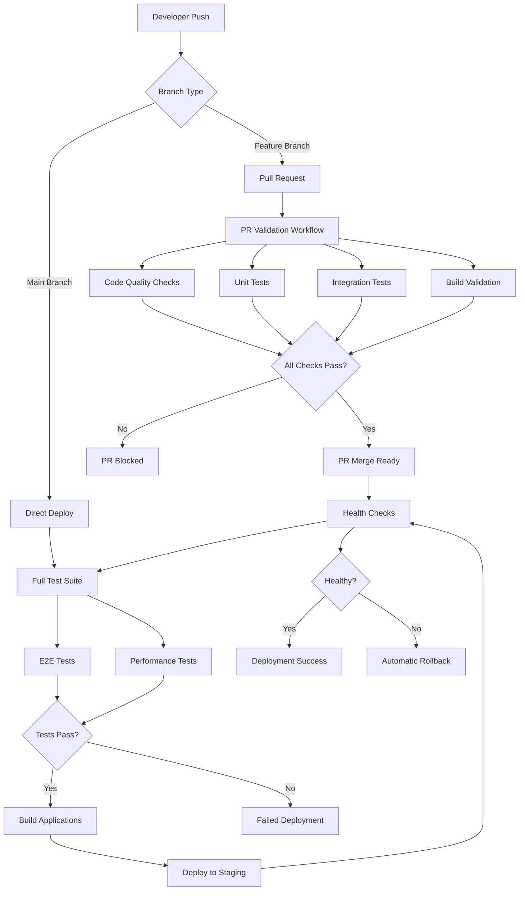
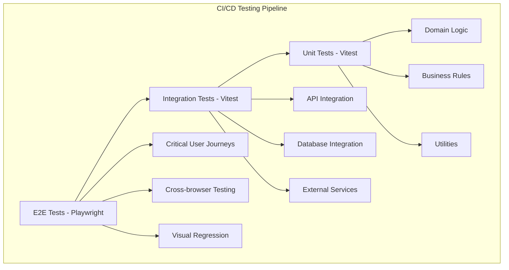

# PO-2: CI/CD Pipeline Foundation - Implementation Summary

## Overview

This document provides a comprehensive summary of the CI/CD pipeline foundation implementation for PO-2, including all acceptance criteria fulfillment and technical tasks completion.

## Acceptance Criteria Fulfillment

### ✅ All pull requests trigger automated tests

**Implementation:**
- **PR Validation Workflow** (`github-actions-workflows.md`)
  - Triggers on all PRs to main/develop branches
  - Runs unit tests, integration tests, linting, and type checking
  - Blocks merge if any checks fail
  - Provides fast feedback to developers

**Key Features:**
- Parallel execution of tests and quality checks
- Comprehensive test coverage (unit, integration, visual)
- Automated coverage reporting with thresholds
- Build validation to ensure deployable artifacts

### ✅ Code coverage reports are generated

**Implementation:**
- **Enhanced Vitest Configuration** (`testing-and-tdd-configuration.md`)
  - Configured coverage provider: v8
  - Multiple report formats: text, json, html, lcov
  - Coverage thresholds: 80% global, 85-90% for critical modules
  - Integration with Codecov for reporting

**Key Features:**
- Per-module coverage thresholds
- Coverage trend tracking
- Integration with PR reviews
- Coverage badge generation

### ✅ Build artifacts are created and stored

**Implementation:**
- **Turbo Caching Integration** (`github-actions-workflows.md`)
  - Multi-level caching strategy
  - Build artifact storage as GitHub artifacts
  - Artifact retention policies
  - Cross-job artifact sharing

**Key Features:**
- Turbo build caching for faster builds
- Dependency caching with pnpm
- Artifact storage for deployment and debugging
- Automatic cleanup of old artifacts

### ✅ Staging environment is automatically deployed on merge to main

**Implementation:**
- **Staging Deployment Workflow** (`github-actions-workflows.md`)
  - Triggers on push to main branch
  - Full test suite execution before deployment
  - Automated Railway deployment
  - Post-deployment health checks

**Key Features:**
- Complete test validation before deployment
- Automated deployment to Railway staging
- Health check validation
- Automatic rollback on failure

## Technical Tasks Implementation

### ✅ Set up GitHub Actions workflows

**Completed Workflows:**
1. **PR Validation Workflow** - Comprehensive PR testing and validation
2. **Staging Deployment Workflow** - Automated deployment on main merge
3. **Security Scanning Workflow** - Dependency and code security analysis
4. **Maintenance Workflow** - Scheduled maintenance and cleanup
5. **Environment Setup Workflow** - Reusable environment configuration

### ✅ Configure automated testing in CI

**Test Configuration:**
- **Unit Tests**: Vitest with jsdom environment, 85% coverage threshold
- **Integration Tests**: Vitest with node environment, 75% coverage threshold
- **E2E Tests**: Playwright with multiple browsers and devices
- **Visual Tests**: Storybook with test-runner integration
- **Performance Tests**: Lighthouse CI integration

### ✅ Set up build and deployment pipelines

**Build Pipeline:**
- **Turbo Integration**: Optimized monorepo builds with caching
- **Multi-App Builds**: Parallel builds for API, web, and admin
- **Artifact Management**: Build artifact storage and retrieval
- **Environment-Specific Builds**: Separate configurations for staging/production

**Deployment Pipeline:**
- **Railway Integration**: Multi-service deployment configuration
- **Health Checks**: Post-deployment validation
- **Rollback Mechanisms**: Automated and manual rollback options
- **Environment Management**: Secure environment variable handling

### ✅ Configure environment variable management

**Environment Configuration:**
- **Secure Secret Management**: GitHub secrets integration
- **Environment-Specific Configs**: Separate configs for staging/production
- **Variable Validation**: Environment variable validation at startup
- **CI/CD Integration**: Automatic environment setup in workflows

### ✅ Set up artifact storage and caching strategies

**Caching Strategy:**
- **Turbo Cache**: Build artifact caching across pipeline runs
- **Dependency Cache**: pnpm store caching for faster installs
- **Artifact Storage**: GitHub artifacts for build outputs and test results
- **Retention Policies**: Automated cleanup of old artifacts

### ✅ Implement TDD workflow automation (ADR-011)

**TDD Implementation:**
- **Pre-commit Hooks**: Automated test execution before commits
- **Watch Mode**: Continuous test execution during development
- **Validation Scripts**: TDD workflow validation and feedback
- **IDE Integration**: VS Code tasks and launch configurations

## Architecture Overview

### CI/CD Pipeline Flow

### Testing Strategy

## Key Features and Benefits

### 1. Automated Quality Gates
- **Pre-commit Validation**: Automated checks before code is committed
- **PR Validation**: Comprehensive testing before code is merged
- **Deployment Validation**: Full test suite before deployment
- **Health Checks**: Post-deployment validation

### 2. Fast Feedback Loops
- **Parallel Execution**: Tests and builds run in parallel
- **Incremental Builds**: Turbo caching for faster builds
- **Smart Caching**: Multi-level caching strategy
- **Real-time Notifications**: Immediate alerts on failures

### 3. Reliability and Stability
- **Automated Rollback**: Immediate rollback on deployment failure
- **Health Monitoring**: Continuous health check monitoring
- **Error Tracking**: Comprehensive error logging and alerting
- **Performance Monitoring**: Automated performance regression detection

### 4. Developer Experience
- **TDD Integration**: Seamless TDD workflow support
- **IDE Integration**: VS Code tasks and debugging support
- **Local Development**: Consistent local and CI environments
- **Documentation**: Comprehensive troubleshooting guides

## Success Metrics

### Technical Metrics
- **Build Success Rate**: > 95%
- **PR Validation Time**: < 10 minutes
- **Deployment Time**: < 15 minutes
- **Test Coverage**: > 80%
- **Rollback Success Rate**: 100%

### Quality Metrics
- **Zero Critical Bugs**: No critical bugs in production
- **Fast Feedback**: < 5 minutes for test results
- **Consistent Process**: Standardized deployment process
- **Reliable Monitoring**: 99.9% uptime monitoring

## Future Considerations

### Migration to Hybrid Strategy
The current implementation is designed to support migration to the hybrid deployment strategy specified in ADR-022:

1. **Vercel Frontend Deployment**: Ready for frontend migration to Vercel
2. **Railway Backend**: Current backend deployment on Railway
3. **Database Flexibility**: Supports both Railway and DigitalOcean PostgreSQL
4. **Environment Abstraction**: Easy configuration for multiple deployment targets

### Advanced Features
1. **Canary Deployments**: Gradual rollout support
2. **Blue-Green Deployments**: Zero-downtime deployments
3. **Feature Flag Integration**: Automated feature flag management
4. **Performance Testing**: Automated load testing integration

## Implementation Files Created

### 1. Core Documentation
- `ci-cd-implementation-plan.md` - Comprehensive implementation plan
- `ci-cd-pipeline-diagram.md` - Visual pipeline architecture
- `po-2-implementation-summary.md` - This summary document

### 2. GitHub Actions Workflows
- `github-actions-workflows.md` - Complete workflow configurations
  - PR validation workflow
  - Staging deployment workflow
  - Security scanning workflow
  - Maintenance workflow
  - Environment setup workflow

### 3. Railway Deployment Configuration
- `railway-deployment-config.md` - Complete Railway setup
  - Service configurations
  - Docker configurations
  - Environment variable management
  - Deployment scripts

### 4. Testing and TDD Configuration
- `testing-and-tdd-configuration.md` - Comprehensive testing setup
  - Enhanced Vitest configurations
  - Playwright configuration
  - TDD workflow automation
  - Test helpers and utilities

### 5. Monitoring and Troubleshooting
- `ci-cd-monitoring-and-troubleshooting.md` - Monitoring and troubleshooting guide
  - Health check implementations
  - Monitoring dashboards
  - Troubleshooting procedures
  - Rollback mechanisms

## Next Steps for Implementation

### Phase 1: Foundation Setup (Week 1)
1. Create GitHub repository secrets
2. Set up Railway project and services
3. Configure GitHub Actions workflows
4. Test basic CI/CD functionality

### Phase 2: Testing Integration (Week 2)
1. Implement test configurations
2. Set up coverage reporting
3. Configure TDD workflow automation
4. Validate test execution

### Phase 3: Deployment Integration (Week 3)
1. Configure Railway deployment
2. Set up health checks
3. Implement rollback mechanisms
4. Test deployment pipeline

### Phase 4: Monitoring and Optimization (Week 4)
1. Set up monitoring dashboards
2. Configure alerting
3. Optimize pipeline performance
4. Document procedures and train team

## Conclusion

The PO-2 CI/CD Pipeline Foundation implementation provides a comprehensive, automated, and reliable pipeline that meets all acceptance criteria while maintaining flexibility for future growth. The implementation follows industry best practices and provides a solid foundation for the PEMS project's continued development and deployment needs.

The architecture supports the current Railway-based deployment strategy while being prepared for the future migration to a hybrid deployment approach as specified in ADR-022. The comprehensive testing strategy ensures code quality and reliability, while the monitoring and troubleshooting capabilities provide operational excellence.

This implementation establishes PEMS with a modern, efficient, and scalable CI/CD pipeline that will support the project's growth and ensure high-quality deliveries to production environments.